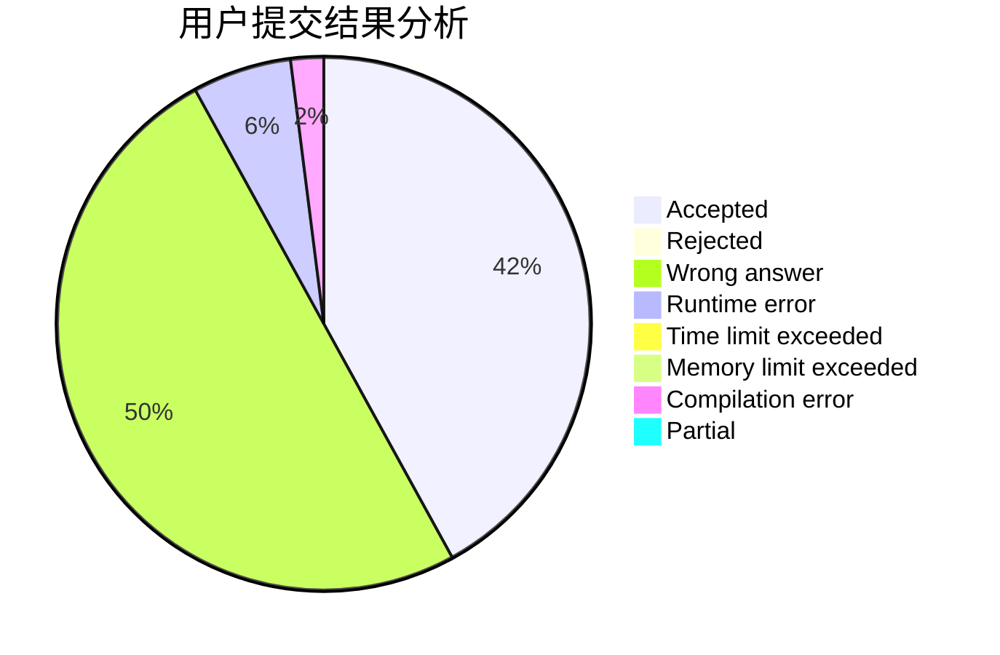
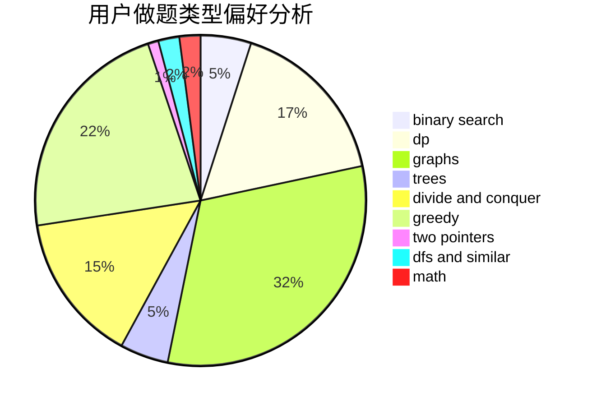

# backcloud

<!-- tabs:start -->

#### **用户提交结果分析**

#### **用户做题类型偏好分析**

<!-- tabs:end -->
# 推荐题目
[817A](https://codeforces.com/contest/817/problem/A)
[672A](https://codeforces.com/contest/672/problem/A)
[314C](https://codeforces.com/contest/314/problem/C)
[521A](https://codeforces.com/contest/521/problem/A)
[781C](https://codeforces.com/contest/781/problem/C)
[602A](https://codeforces.com/contest/602/problem/A)
[439D](https://codeforces.com/contest/439/problem/D)
[152D](https://codeforces.com/contest/152/problem/D)
[1083B](https://codeforces.com/contest/1083/problem/B)
[1143E](https://codeforces.com/contest/1143/problem/E)
