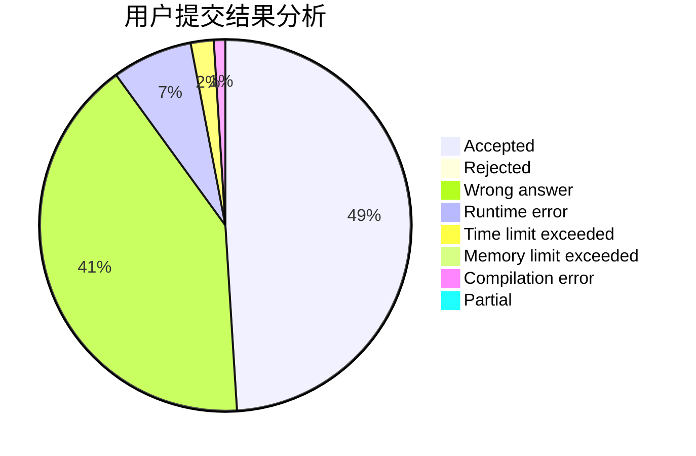
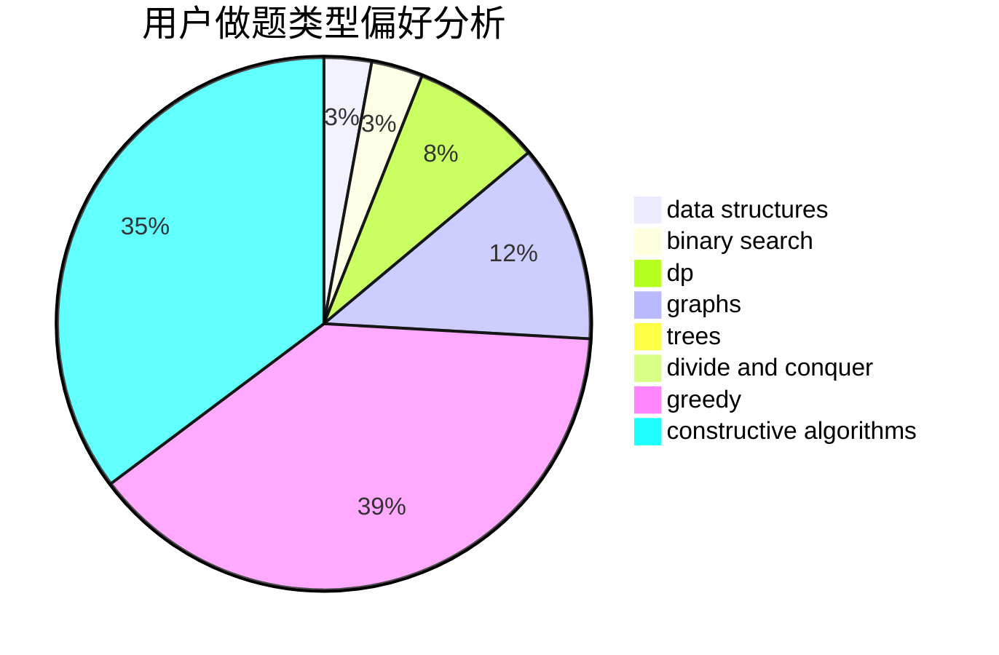
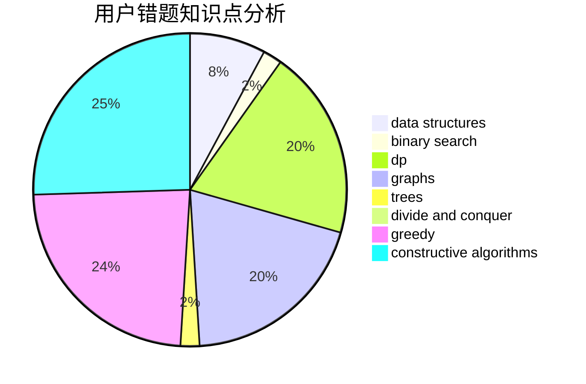

# backup_noob

<!-- tabs:start -->

#### **用户提交结果分析**

#### **用户做题类型偏好分析**

#### **用户错题知识点分析**

<!-- tabs:end -->
# 推荐题目
[232B](https://codeforces.com/contest/232/problem/B)		bitmasks,
                        combinatorics,
                        dp,
                        math		  
[1005C](https://codeforces.com/contest/1005/problem/C)		brute force,
                        greedy,
                        implementation		  
[852I](https://codeforces.com/contest/852/problem/I)		brute force,
                        dfs and similar,
                        graphs,
                        trees		  
[965A](https://codeforces.com/contest/965/problem/A)		math		  
[1207A](https://codeforces.com/contest/1207/problem/A)		brute force,
                        greedy,
                        implementation,
                        math		  
[1340D](https://codeforces.com/contest/1340/problem/D)		constructive algorithms,
                        dfs and similar,
                        graphs,
                        trees		  
[1047A](https://codeforces.com/contest/1047/problem/A)		math		  
[670D1](https://codeforces.com/contest/670D/problem/1)		binary search,
                        brute force,
                        implementation		  
[1146D](https://codeforces.com/contest/1146/problem/D)		dfs and similar,
                        math,
                        number theory		  
[356A](https://codeforces.com/contest/356/problem/A)		data structures,
                        dsu		  
