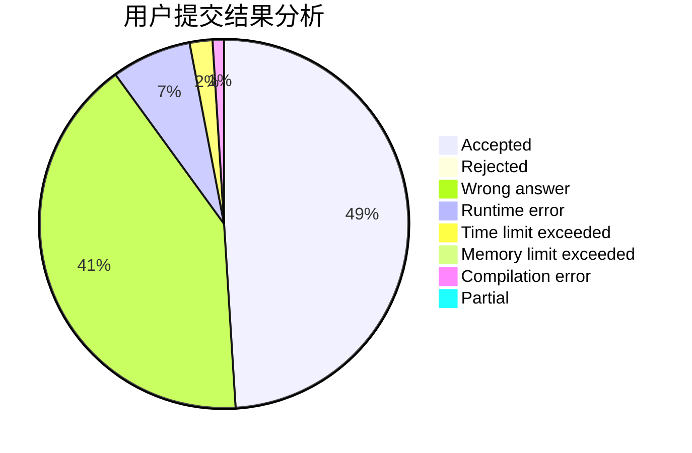
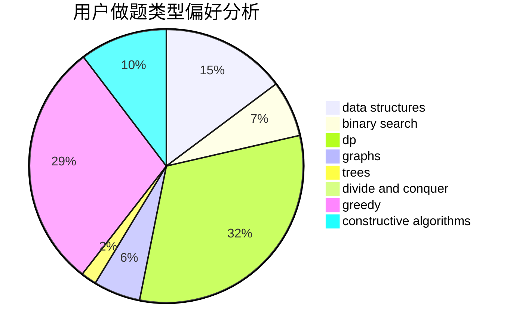
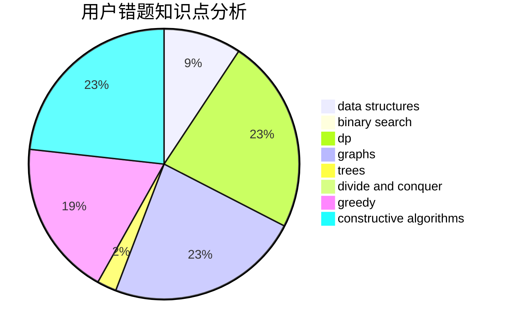

# backup_noob

<!-- tabs:start -->

#### **用户提交结果分析**

#### **用户做题类型偏好分析**

#### **用户错题知识点分析**

<!-- tabs:end -->
# 推荐题目
[254A](https://codeforces.com/contest/254/problem/A)		constructive algorithms,
                        sortings		  
[1005D](https://codeforces.com/contest/1005/problem/D)		dp,
                        greedy,
                        number theory		  
[871A](https://codeforces.com/contest/871/problem/A)		dsu,graphs,sortings,trees		  
[987A](https://codeforces.com/contest/987/problem/A)		implementation		  
[1211A](https://codeforces.com/contest/1211/problem/A)		*special problem,
                        implementation		  
[1347C](https://codeforces.com/contest/1347/problem/C)		dsu,graphs,sortings,trees		  
[1047D](https://codeforces.com/contest/1047/problem/D)		dsu,graphs,sortings,trees		  
[696B](https://codeforces.com/contest/696/problem/B)		dfs and similar,
                        math,
                        probabilities,
                        trees		  
[1148D](https://codeforces.com/contest/1148/problem/D)		greedy,
                        sortings		  
[380E](https://codeforces.com/contest/380/problem/E)		data structures		  
