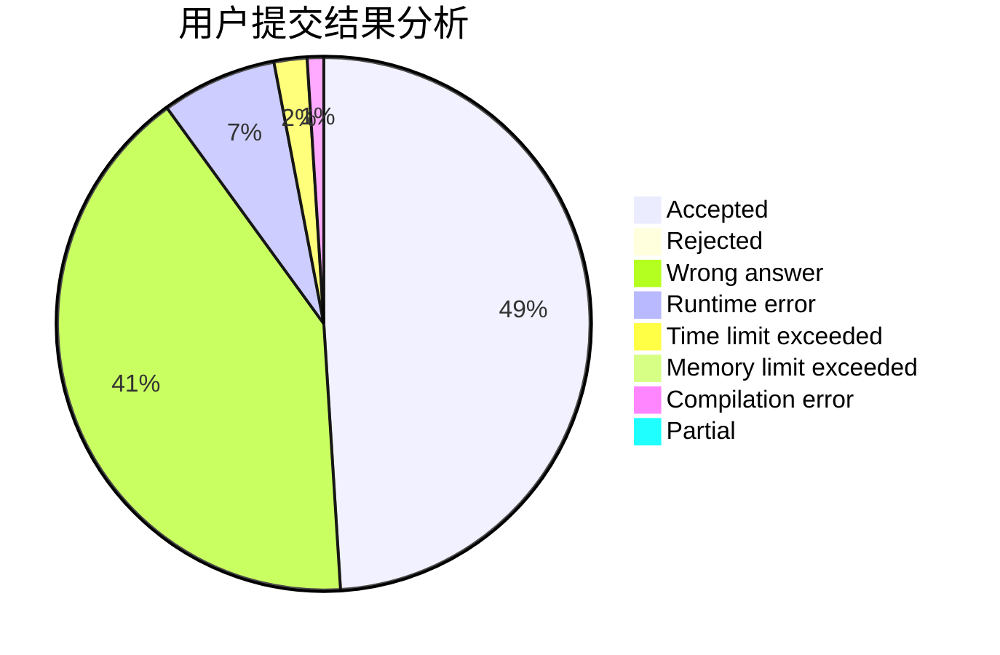
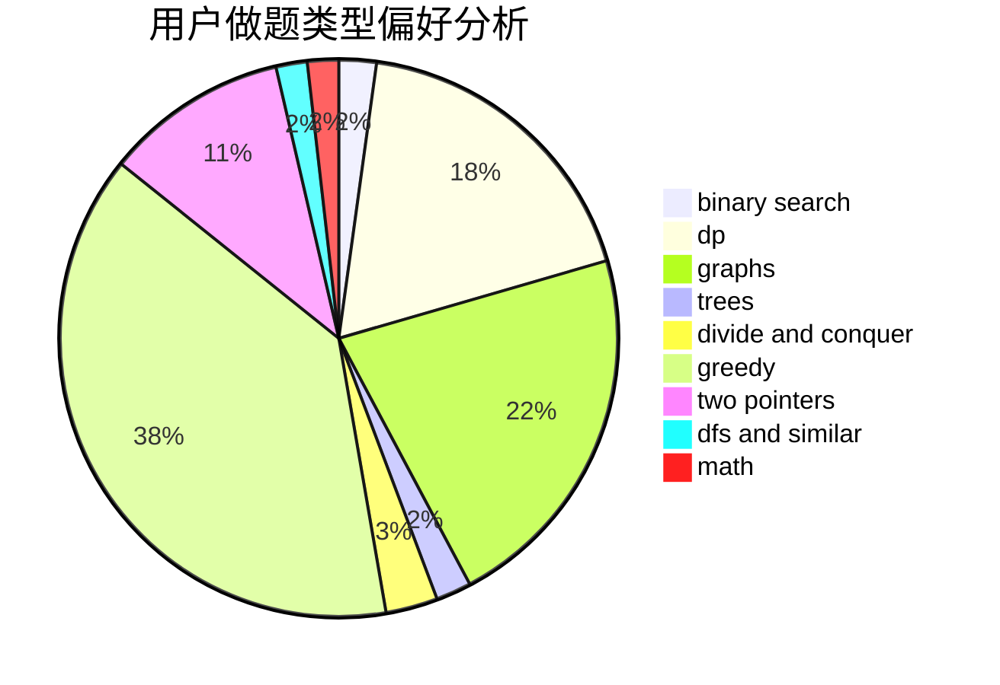

# backup_noob

<!-- tabs:start -->

#### **用户提交结果分析**

#### **用户做题类型偏好分析**

<!-- tabs:end -->
# 推荐题目
[254A](https://codeforces.com/contest/254/problem/A)
[1005D](https://codeforces.com/contest/1005/problem/D)
[871A](https://codeforces.com/contest/871/problem/A)
[987A](https://codeforces.com/contest/987/problem/A)
[1211A](https://codeforces.com/contest/1211/problem/A)
[1347C](https://codeforces.com/contest/1347/problem/C)
[1047D](https://codeforces.com/contest/1047/problem/D)
[696B](https://codeforces.com/contest/696/problem/B)
[1148D](https://codeforces.com/contest/1148/problem/D)
[380E](https://codeforces.com/contest/380/problem/E)
