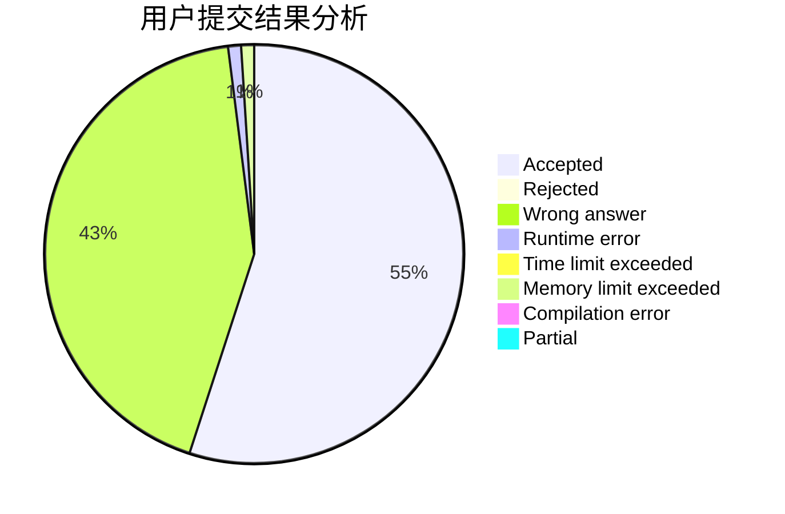
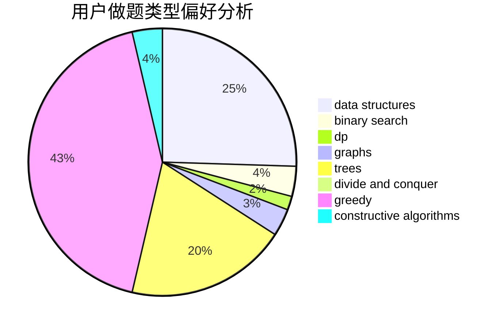

# baddog

<!-- tabs:start -->

#### **用户提交结果分析**

#### **用户做题类型偏好分析**

#### **用户错题知识点分析**

<!-- tabs:end -->
# 推荐题目
[1268E](https://codeforces.com/contest/1268/problem/E)		dp		  
[1079C](https://codeforces.com/contest/1079/problem/C)		dsu,graphs,sortings,trees		  
[383C](https://codeforces.com/contest/383/problem/C)		data structures,
                        dfs and similar,
                        trees		  
[681B](https://codeforces.com/contest/681/problem/B)		brute force		  
[1195A](https://codeforces.com/contest/1195/problem/A)		greedy,
                        math		  
[369B](https://codeforces.com/contest/369/problem/B)		constructive algorithms,
                        implementation,
                        math		  
[542D](https://codeforces.com/contest/542/problem/D)		dfs and similar,
                        dp,
                        hashing,
                        math,
                        number theory		  
[1393D](https://codeforces.com/contest/1393/problem/D)		dfs and similar,
                        dp,
                        implementation,
                        shortest paths		  
[1095E](https://codeforces.com/contest/1095/problem/E)		implementation		  
[1437A](https://codeforces.com/contest/1437/problem/A)		brute force,
                        constructive algorithms,
                        greedy,
                        math		  
