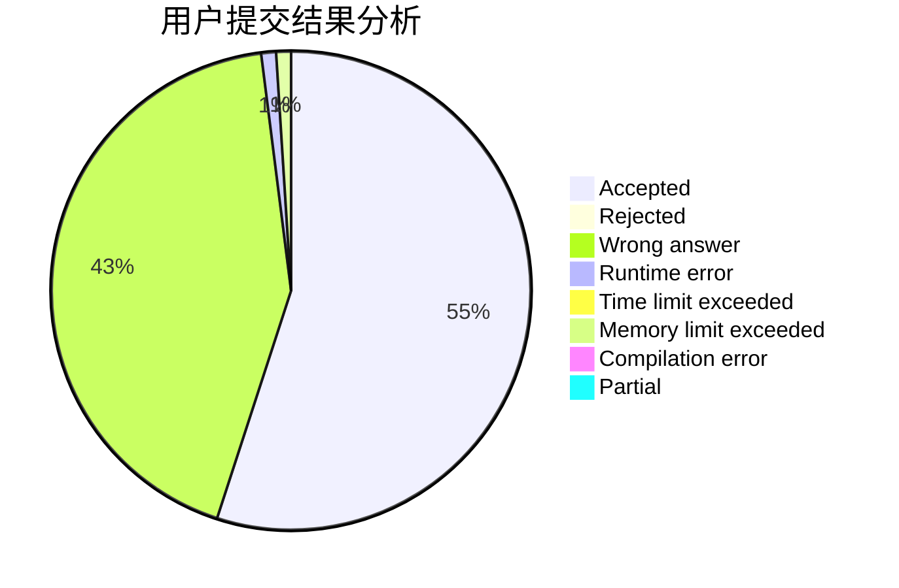
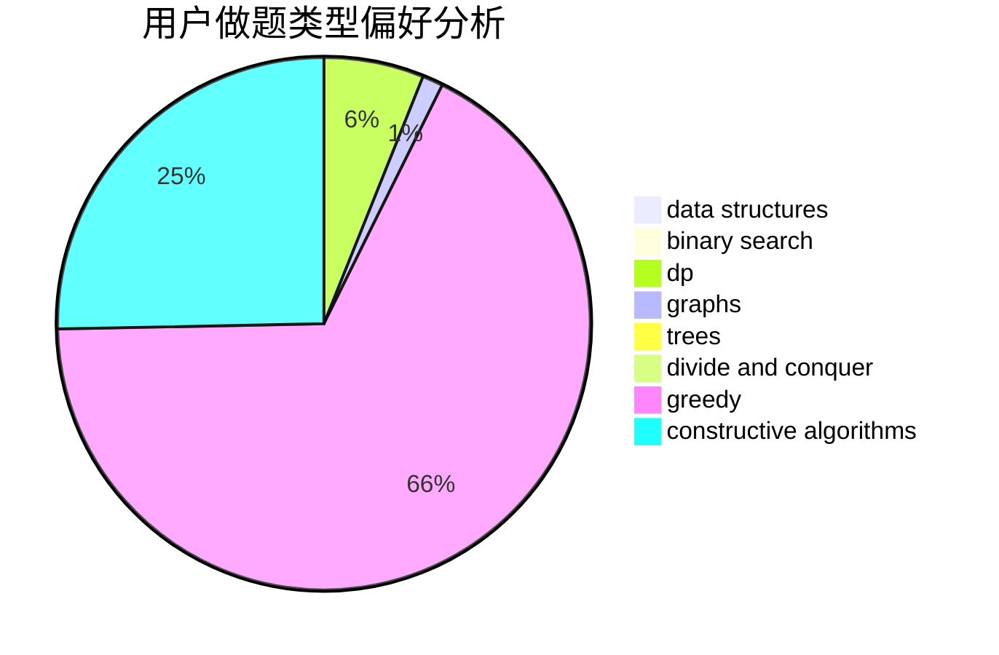

# baddog

<!-- tabs:start -->

#### **用户提交结果分析**

#### **用户做题类型偏好分析**

#### **用户错题知识点分析**

<!-- tabs:end -->
# 推荐题目
[1277F](https://codeforces.com/contest/1277/problem/F)		dsu,graphs,sortings,trees		  
[107B](https://codeforces.com/contest/107/problem/B)		combinatorics,
                        dp,
                        math,
                        probabilities		  
[414C](https://codeforces.com/contest/414/problem/C)		combinatorics,
                        divide and conquer		  
[705A](https://codeforces.com/contest/705/problem/A)		implementation		  
[1199C](https://codeforces.com/contest/1199/problem/C)		dsu,graphs,sortings,trees		  
[39D](https://codeforces.com/contest/39/problem/D)		math		  
[566G](https://codeforces.com/contest/566/problem/G)		geometry		  
[1401C](https://codeforces.com/contest/1401/problem/C)		constructive algorithms,
                        math,
                        number theory,
                        sortings		  
[1096B](https://codeforces.com/contest/1096/problem/B)		combinatorics,
                        math,
                        strings		  
[1446F](https://codeforces.com/contest/1446/problem/F)		binary search,
                        data structures,
                        geometry		  
