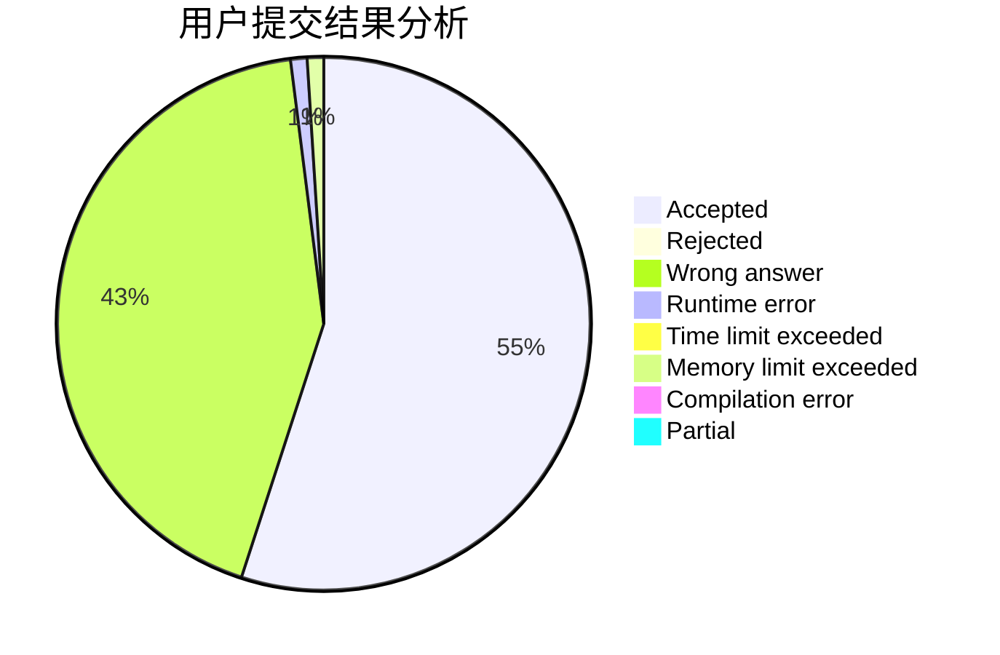
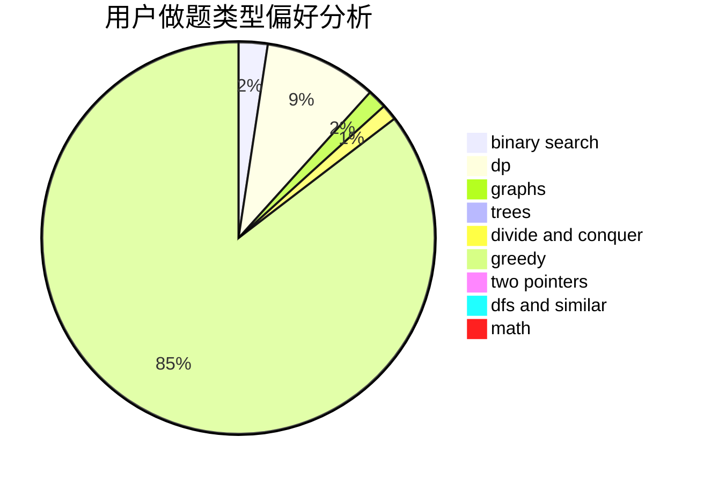

# baddog

<!-- tabs:start -->

#### **用户提交结果分析**

#### **用户做题类型偏好分析**

<!-- tabs:end -->
# 推荐题目
[1277F](https://codeforces.com/contest/1277/problem/F)
[107B](https://codeforces.com/contest/107/problem/B)
[414C](https://codeforces.com/contest/414/problem/C)
[705A](https://codeforces.com/contest/705/problem/A)
[1199C](https://codeforces.com/contest/1199/problem/C)
[39D](https://codeforces.com/contest/39/problem/D)
[566G](https://codeforces.com/contest/566/problem/G)
[1401C](https://codeforces.com/contest/1401/problem/C)
[1096B](https://codeforces.com/contest/1096/problem/B)
[1446F](https://codeforces.com/contest/1446/problem/F)
