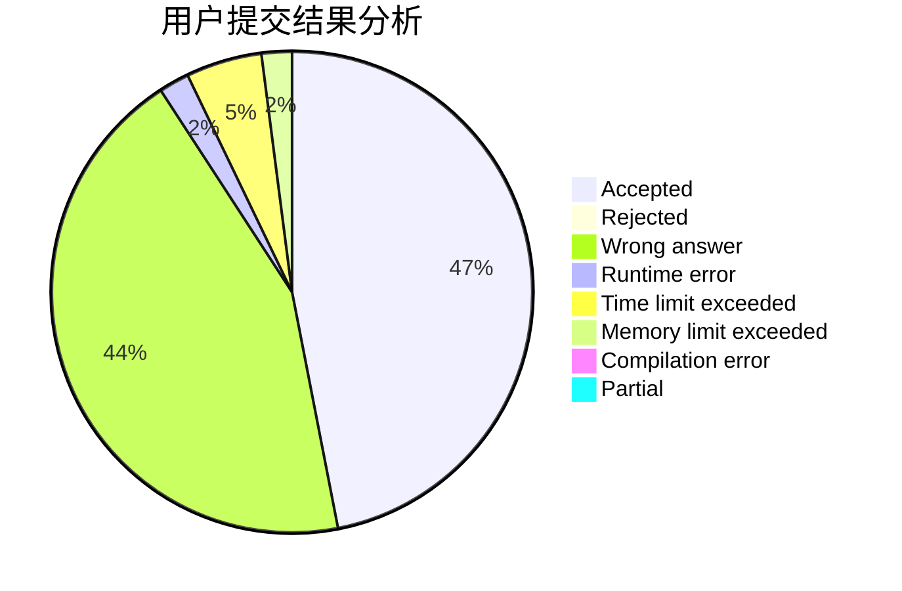
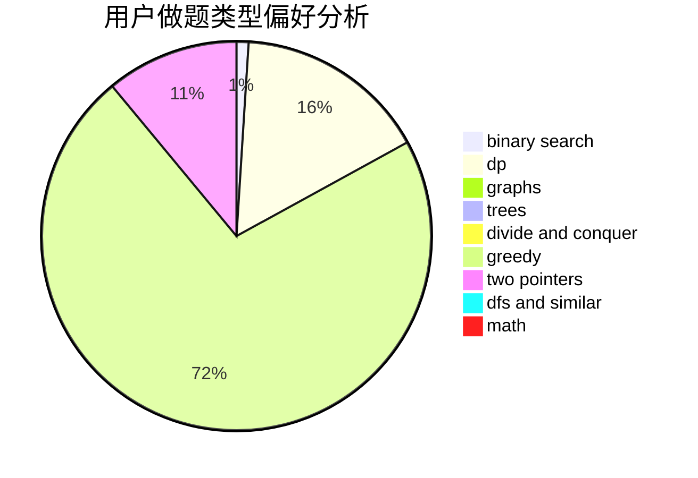

# badoge

<!-- tabs:start -->

#### **用户提交结果分析**

#### **用户做题类型偏好分析**

<!-- tabs:end -->
# 推荐题目
[870A](https://codeforces.com/contest/870/problem/A)
[293C](https://codeforces.com/contest/293/problem/C)
[28A](https://codeforces.com/contest/28/problem/A)
[873C](https://codeforces.com/contest/873/problem/C)
[1479E](https://codeforces.com/contest/1479/problem/E)
[1427E](https://codeforces.com/contest/1427/problem/E)
[828E](https://codeforces.com/contest/828/problem/E)
[1504D](https://codeforces.com/contest/1504/problem/D)
[1490C](https://codeforces.com/contest/1490/problem/C)
[1497B](https://codeforces.com/contest/1497/problem/B)
