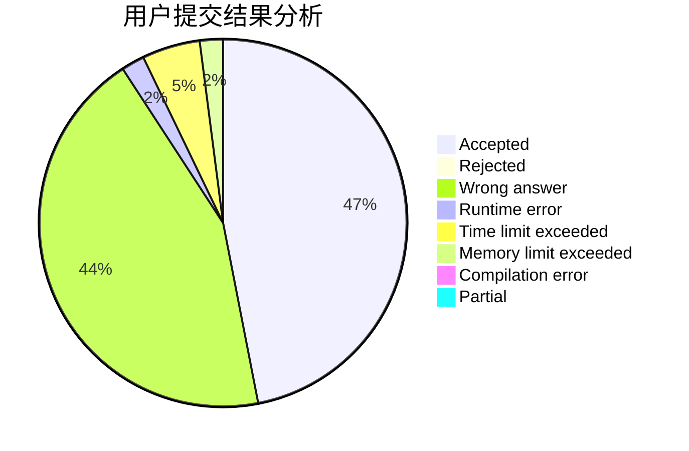
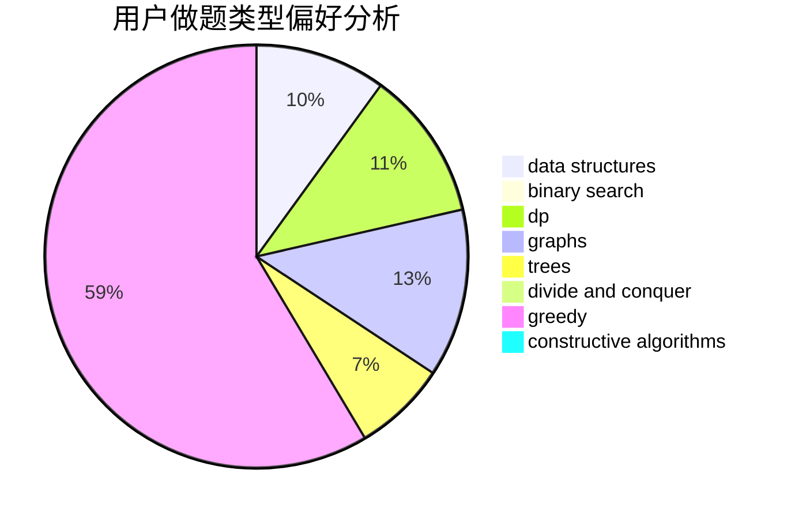
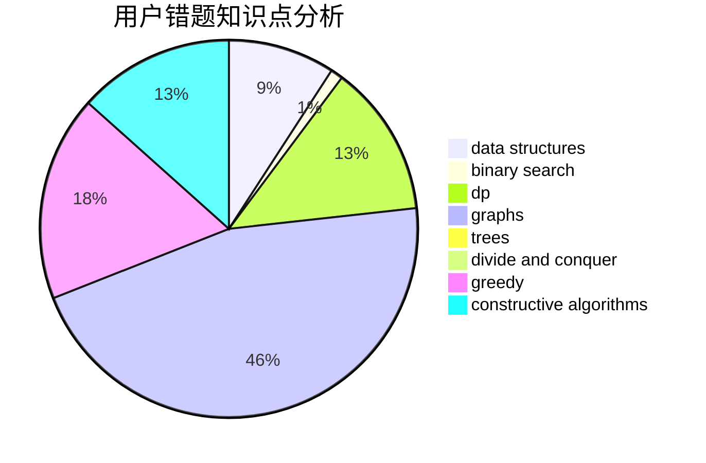

# badoge

<!-- tabs:start -->

#### **用户提交结果分析**

#### **用户做题类型偏好分析**

#### **用户错题知识点分析**

<!-- tabs:end -->
# 推荐题目
[851D](https://codeforces.com/contest/851/problem/D)		dsu,graphs,sortings,trees		  
[278C](https://codeforces.com/contest/278/problem/C)		dsu,graphs,sortings,trees		  
[274B](https://codeforces.com/contest/274/problem/B)		dfs and similar,
                        dp,
                        greedy,
                        trees		  
[855B](https://codeforces.com/contest/855/problem/B)		brute force,
                        data structures,
                        dp		  
[1471C](https://codeforces.com/contest/1471/problem/C)		dsu,graphs,sortings,trees		  
[1419F](https://codeforces.com/contest/1419/problem/F)		binary search,
                        data structures,
                        dfs and similar,
                        dsu,
                        graphs,
                        implementation		  
[810E](https://codeforces.com/contest/810/problem/E)		dsu,graphs,sortings,trees		  
[1495D](https://codeforces.com/contest/1495/problem/D)		combinatorics,
                        dfs and similar,
                        graphs,
                        math,
                        shortest paths,
                        trees		  
[1482E](https://codeforces.com/contest/1482/problem/E)		data structures,
                        divide and conquer,
                        dp		  
[1489D](https://codeforces.com/contest/1489/problem/D)		dsu,graphs,sortings,trees		  
