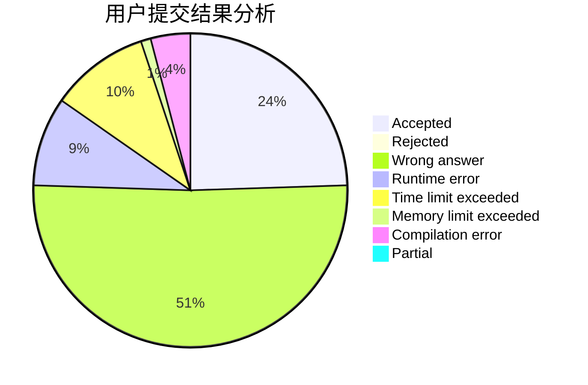
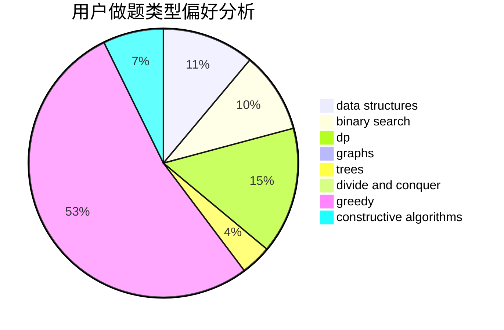
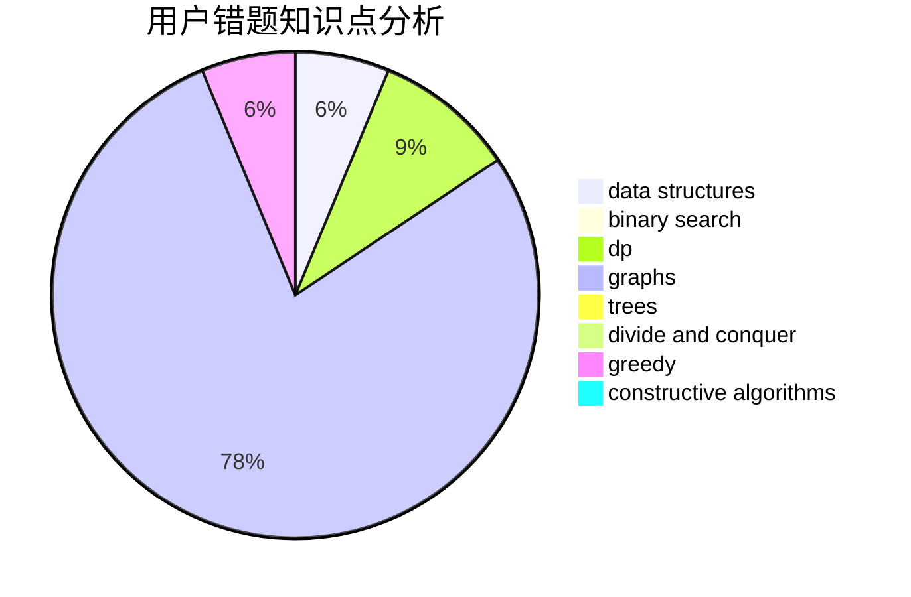

# badwomanx

<!-- tabs:start -->

#### **用户提交结果分析**

#### **用户做题类型偏好分析**

#### **用户错题知识点分析**

<!-- tabs:end -->
# 推荐题目
[1153C](https://codeforces.com/contest/1153/problem/C)		greedy,
                        strings		  
[1501E](https://codeforces.com/contest/1501/problem/E)		dsu,graphs,sortings,trees		  
[765C](https://codeforces.com/contest/765/problem/C)		math		  
[746B](https://codeforces.com/contest/746/problem/B)		implementation,
                        strings		  
[659G](https://codeforces.com/contest/659/problem/G)		combinatorics,
                        dp,
                        number theory		  
[494B](https://codeforces.com/contest/494/problem/B)		dp,
                        strings		  
[1368E](https://codeforces.com/contest/1368/problem/E)		constructive algorithms,
                        graphs,
                        greedy		  
[755G](https://codeforces.com/contest/755/problem/G)		combinatorics,
                        divide and conquer,
                        dp,
                        fft,
                        math,
                        number theory		  
[940A](https://codeforces.com/contest/940/problem/A)		brute force,
                        greedy,
                        sortings		  
[1054C](https://codeforces.com/contest/1054/problem/C)		constructive algorithms,
                        implementation		  
