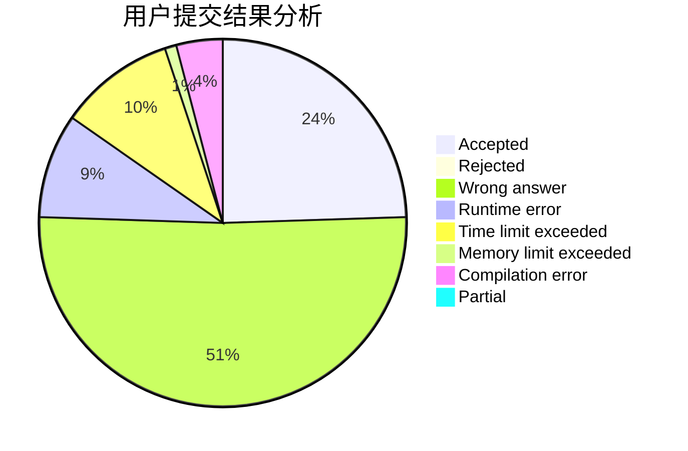
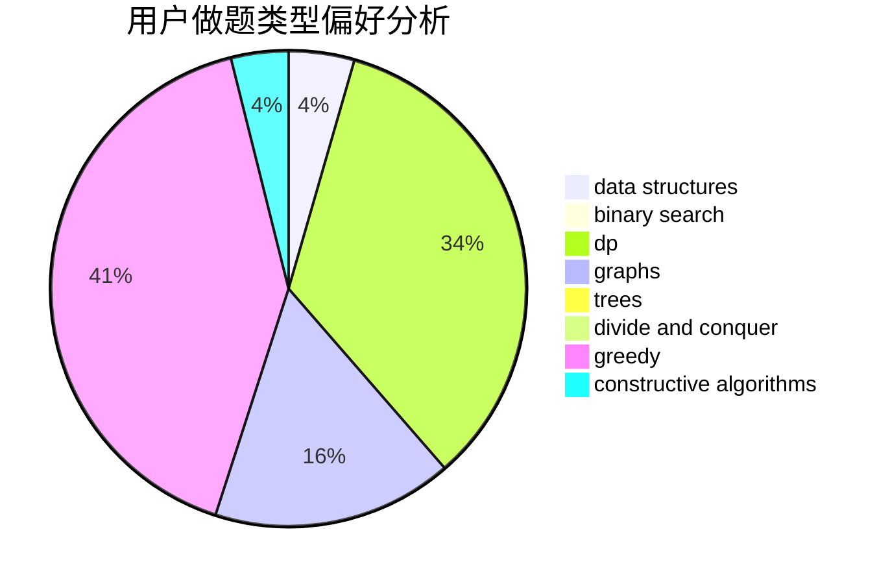
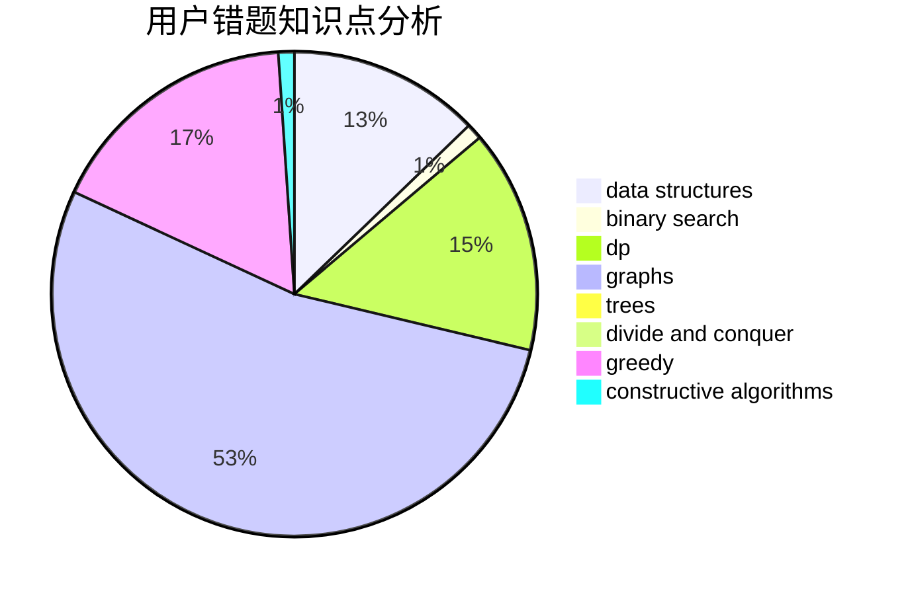

# badwomanx

<!-- tabs:start -->

#### **用户提交结果分析**

#### **用户做题类型偏好分析**

#### **用户错题知识点分析**

<!-- tabs:end -->
# 推荐题目
[1151C](https://codeforces.com/contest/1151/problem/C)		constructive algorithms,
                        math		  
[1493E](https://codeforces.com/contest/1493/problem/E)		bitmasks,
                        constructive algorithms,
                        greedy,
                        math,
                        strings,
                        two pointers		  
[746A](https://codeforces.com/contest/746/problem/A)		implementation,
                        math		  
[729B](https://codeforces.com/contest/729/problem/B)		dp,
                        implementation		  
[62E](https://codeforces.com/contest/62/problem/E)		dp,
                        flows		  
[475B](https://codeforces.com/contest/475/problem/B)		brute force,
                        dfs and similar,
                        graphs,
                        implementation		  
[1360F](https://codeforces.com/contest/1360/problem/F)		bitmasks,
                        brute force,
                        constructive algorithms,
                        dp,
                        hashing,
                        strings		  
[735A](https://codeforces.com/contest/735/problem/A)		implementation,
                        strings		  
[920A](https://codeforces.com/contest/920/problem/A)		implementation		  
[1053E](https://codeforces.com/contest/1053/problem/E)		constructive algorithms,
                        trees		  
