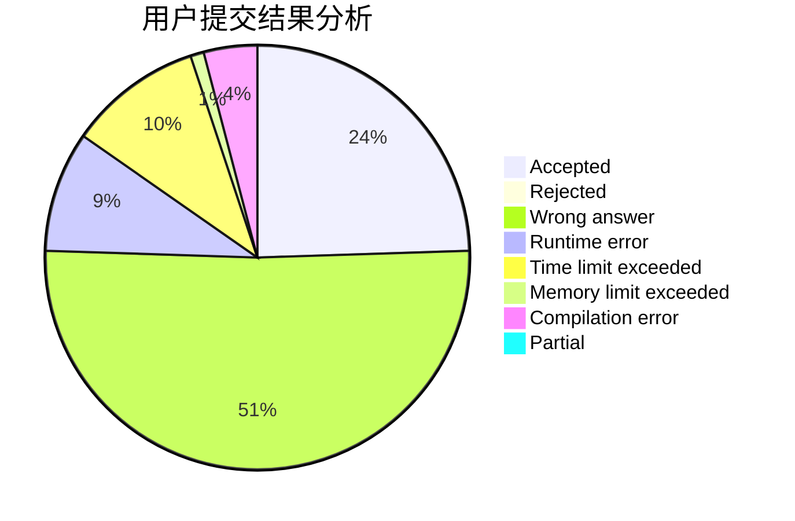
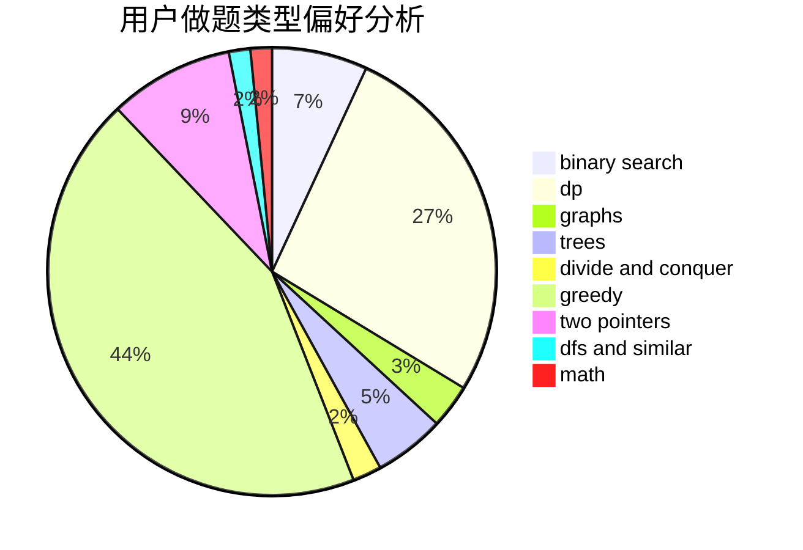

# badwomanx

<!-- tabs:start -->

#### **用户提交结果分析**

#### **用户做题类型偏好分析**

<!-- tabs:end -->
# 推荐题目
[1153C](https://codeforces.com/contest/1153/problem/C)
[1501E](https://codeforces.com/contest/1501/problem/E)
[765C](https://codeforces.com/contest/765/problem/C)
[746B](https://codeforces.com/contest/746/problem/B)
[659G](https://codeforces.com/contest/659/problem/G)
[494B](https://codeforces.com/contest/494/problem/B)
[1368E](https://codeforces.com/contest/1368/problem/E)
[755G](https://codeforces.com/contest/755/problem/G)
[940A](https://codeforces.com/contest/940/problem/A)
[1054C](https://codeforces.com/contest/1054/problem/C)
