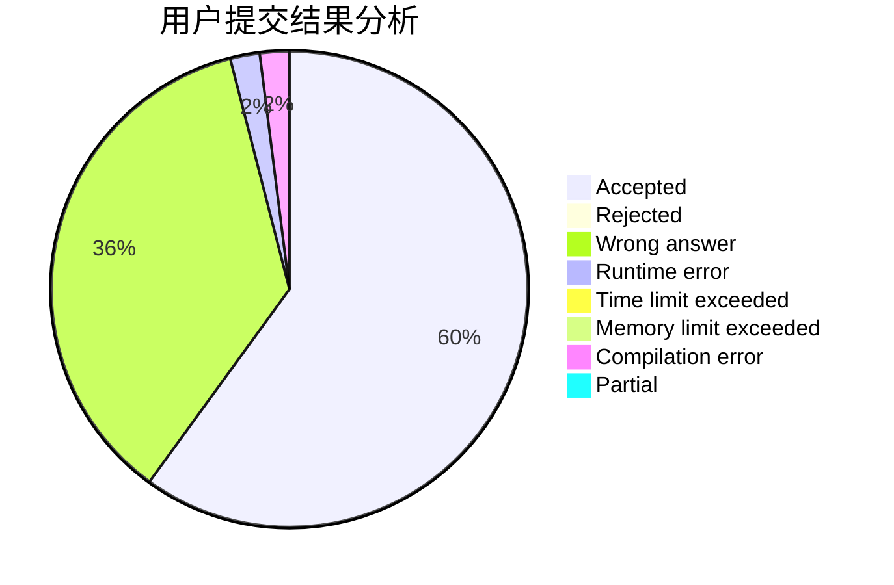
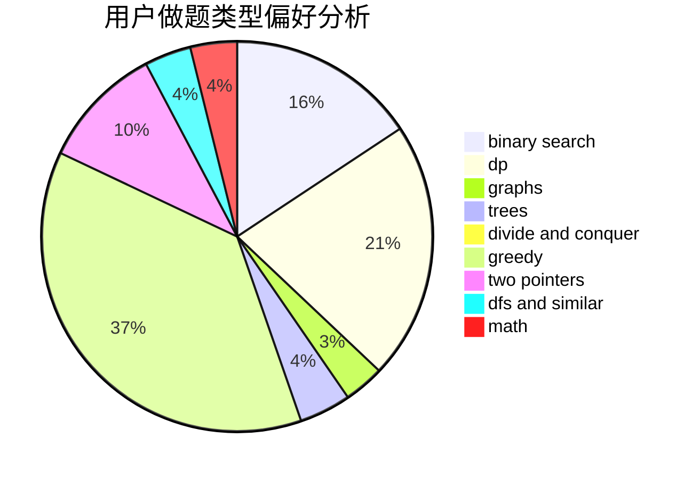

# baitianshuijiao2

<!-- tabs:start -->

#### **用户提交结果分析**

#### **用户做题类型偏好分析**

<!-- tabs:end -->
# 推荐题目
[946D](https://codeforces.com/contest/946/problem/D)
[13764](https://codeforces.com/contest/1376/problem/4)
[716A](https://codeforces.com/contest/716/problem/A)
[1271F](https://codeforces.com/contest/1271/problem/F)
[997D](https://codeforces.com/contest/997/problem/D)
[1476F](https://codeforces.com/contest/1476/problem/F)
[581B](https://codeforces.com/contest/581/problem/B)
[344A](https://codeforces.com/contest/344/problem/A)
[1379A](https://codeforces.com/contest/1379/problem/A)
[438D](https://codeforces.com/contest/438/problem/D)
