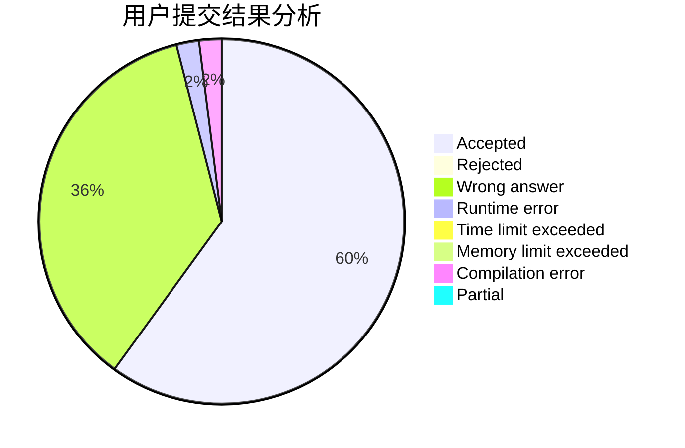
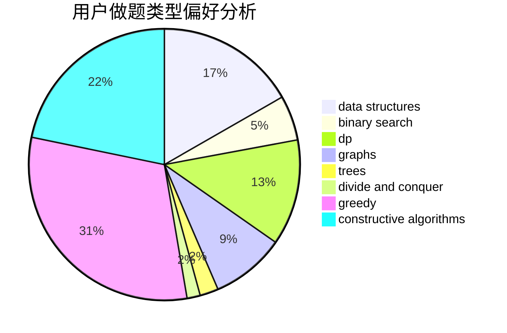
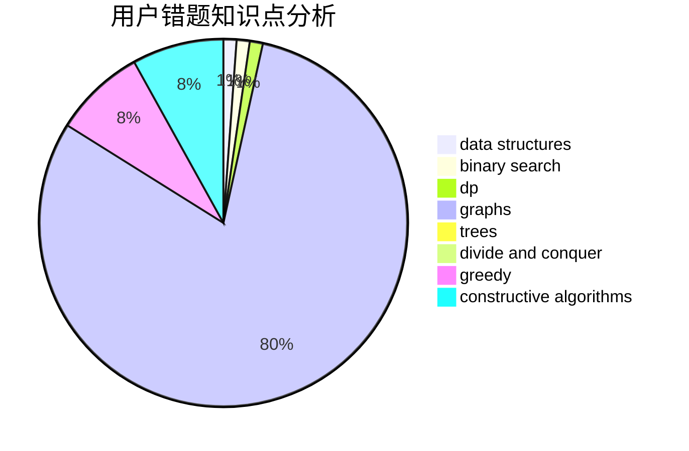

# baitianshuijiao2

<!-- tabs:start -->

#### **用户提交结果分析**

#### **用户做题类型偏好分析**

#### **用户错题知识点分析**

<!-- tabs:end -->
# 推荐题目
[922D](https://codeforces.com/contest/922/problem/D)		greedy,
                        sortings		  
[1369E](https://codeforces.com/contest/1369/problem/E)		data structures,
                        dfs and similar,
                        greedy,
                        implementation,
                        sortings		  
[699B](https://codeforces.com/contest/699/problem/B)		implementation		  
[1266E](https://codeforces.com/contest/1266/problem/E)		data structures,
                        greedy,
                        implementation		  
[982A](https://codeforces.com/contest/982/problem/A)		brute force,
                        constructive algorithms		  
[1468L](https://codeforces.com/contest/1468/problem/L)		binary search,
                        greedy,
                        math,
                        number theory		  
[558D](https://codeforces.com/contest/558/problem/D)		data structures,
                        implementation,
                        sortings		  
[316G1](https://codeforces.com/contest/316G/problem/1)		hashing,
                        strings		  
[1370D](https://codeforces.com/contest/1370/problem/D)		binary search,
                        dp,
                        dsu,
                        greedy,
                        implementation		  
[412E](https://codeforces.com/contest/412/problem/E)		implementation		  
