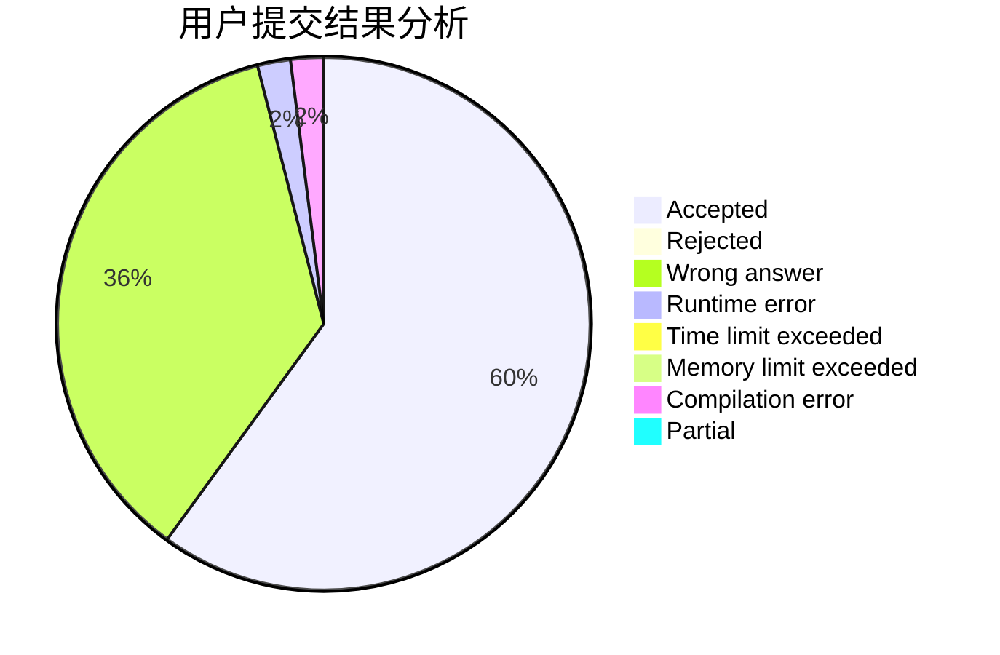
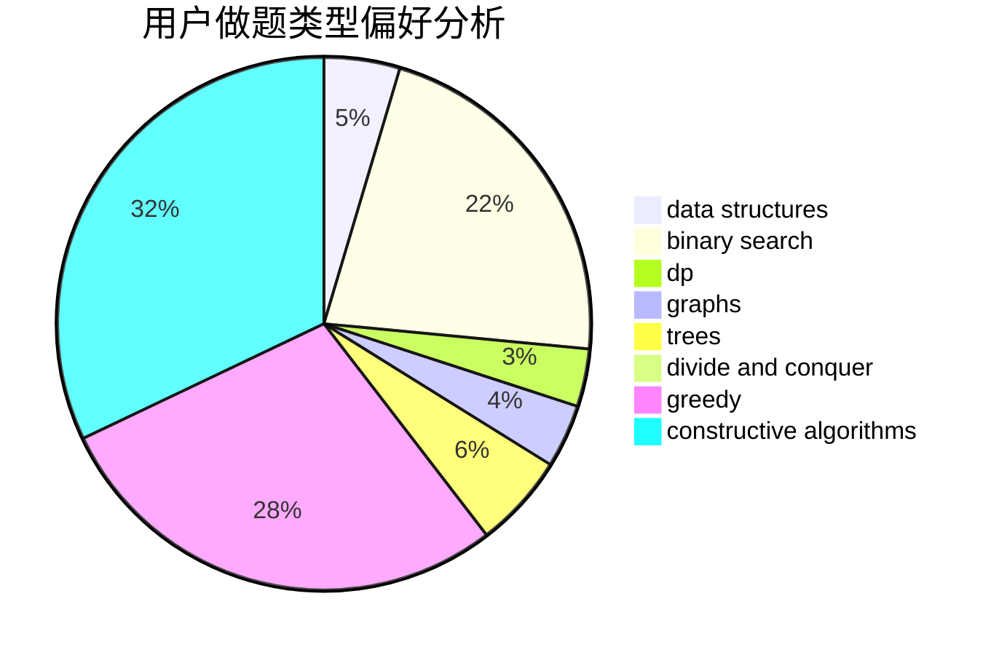
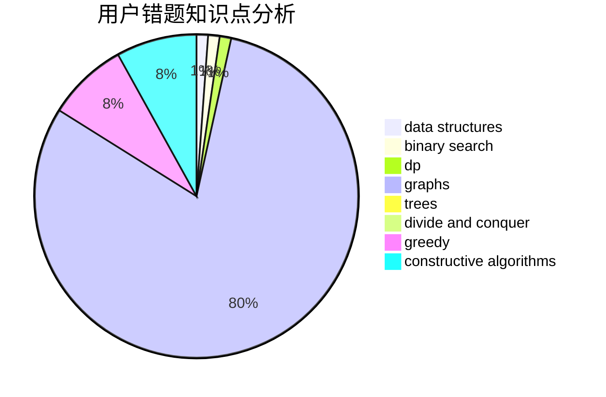

# baitianshuijiao2

<!-- tabs:start -->

#### **用户提交结果分析**

#### **用户做题类型偏好分析**

#### **用户错题知识点分析**

<!-- tabs:end -->
# 推荐题目
[946D](https://codeforces.com/contest/946/problem/D)		dp		  
[13764](https://codeforces.com/contest/1376/problem/4)		dsu,graphs,sortings,trees		  
[716A](https://codeforces.com/contest/716/problem/A)		implementation		  
[1271F](https://codeforces.com/contest/1271/problem/F)		brute force		  
[997D](https://codeforces.com/contest/997/problem/D)		combinatorics,
                        divide and conquer,
                        trees		  
[1476F](https://codeforces.com/contest/1476/problem/F)		binary search,
                        data structures,
                        dp		  
[581B](https://codeforces.com/contest/581/problem/B)		implementation,
                        math		  
[344A](https://codeforces.com/contest/344/problem/A)		implementation		  
[1379A](https://codeforces.com/contest/1379/problem/A)		brute force,
                        implementation,
                        strings		  
[438D](https://codeforces.com/contest/438/problem/D)		data structures,
                        math		  
