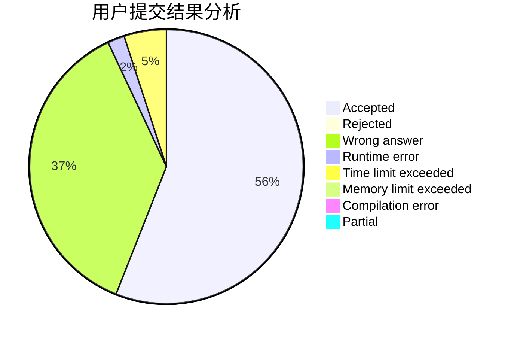
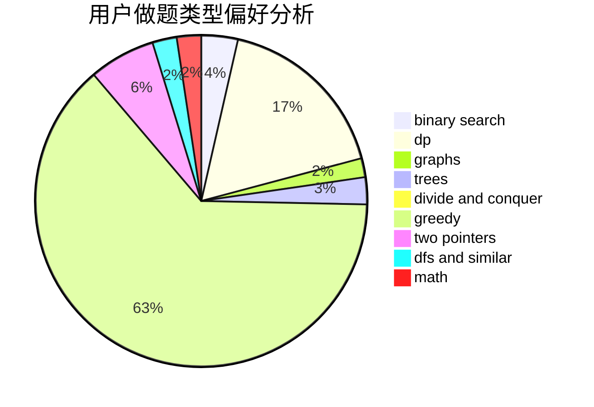

# baodaqing

<!-- tabs:start -->

#### **用户提交结果分析**

#### **用户做题类型偏好分析**

<!-- tabs:end -->
# 推荐题目
[11882](https://codeforces.com/contest/1188/problem/2)
[520A](https://codeforces.com/contest/520/problem/A)
[845D](https://codeforces.com/contest/845/problem/D)
[3D](https://codeforces.com/contest/3/problem/D)
[349B](https://codeforces.com/contest/349/problem/B)
[847E](https://codeforces.com/contest/847/problem/E)
[996C](https://codeforces.com/contest/996/problem/C)
[509D](https://codeforces.com/contest/509/problem/D)
[816D](https://codeforces.com/contest/816/problem/D)
[691A](https://codeforces.com/contest/691/problem/A)
