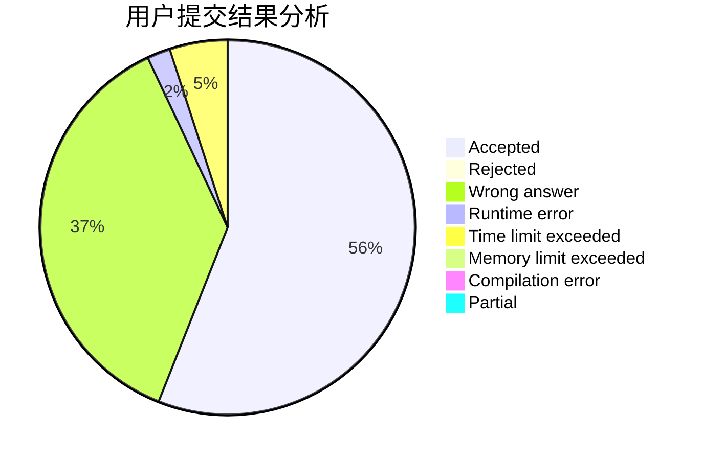
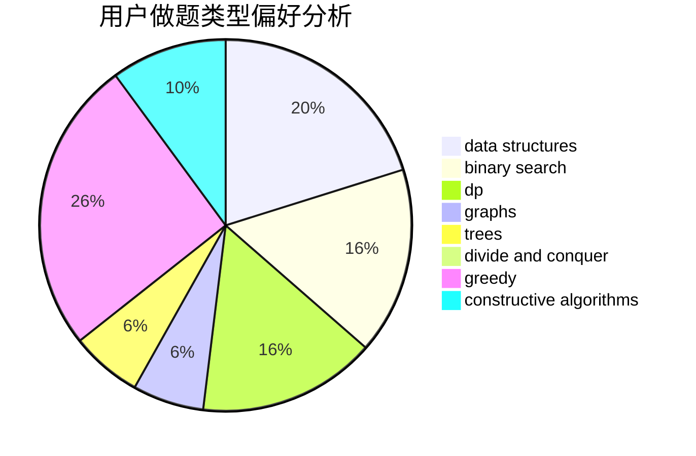
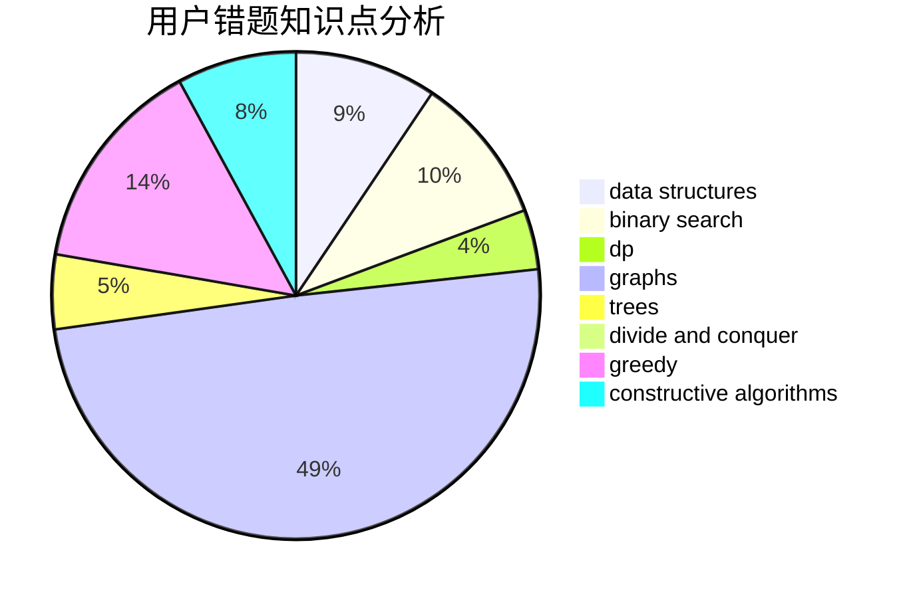

# baodaqing

<!-- tabs:start -->

#### **用户提交结果分析**

#### **用户做题类型偏好分析**

#### **用户错题知识点分析**

<!-- tabs:end -->
# 推荐题目
[11882](https://codeforces.com/contest/1188/problem/2)		dsu,graphs,sortings,trees		  
[520A](https://codeforces.com/contest/520/problem/A)		implementation,
                        strings		  
[845D](https://codeforces.com/contest/845/problem/D)		data structures,
                        dp,
                        greedy		  
[3D](https://codeforces.com/contest/3/problem/D)		greedy		  
[349B](https://codeforces.com/contest/349/problem/B)		data structures,
                        dp,
                        greedy,
                        implementation		  
[847E](https://codeforces.com/contest/847/problem/E)		binary search,
                        dp		  
[996C](https://codeforces.com/contest/996/problem/C)		dsu,graphs,sortings,trees		  
[509D](https://codeforces.com/contest/509/problem/D)		constructive algorithms,
                        math		  
[816D](https://codeforces.com/contest/816/problem/D)		dsu,graphs,sortings,trees		  
[691A](https://codeforces.com/contest/691/problem/A)		implementation		  
