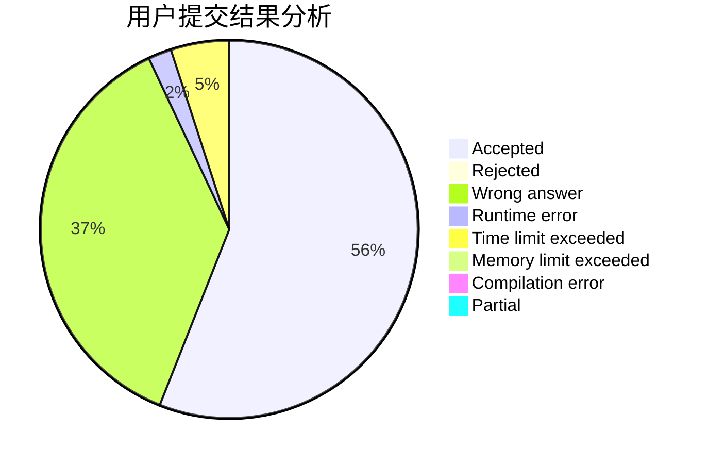
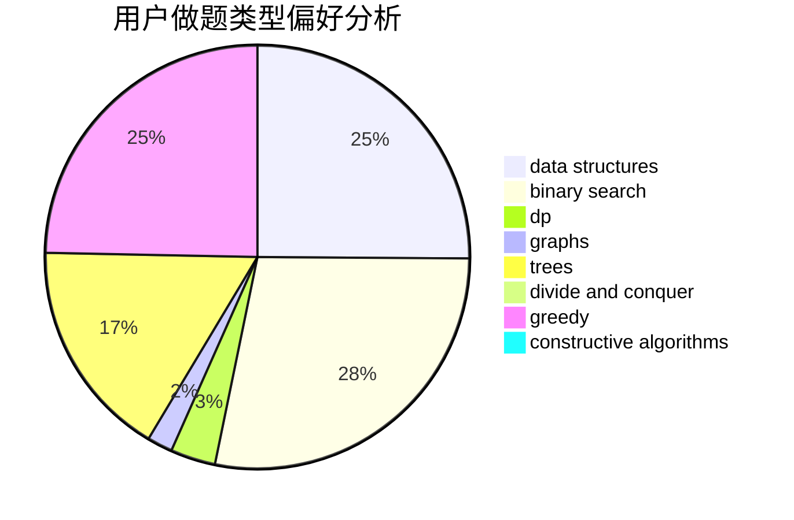
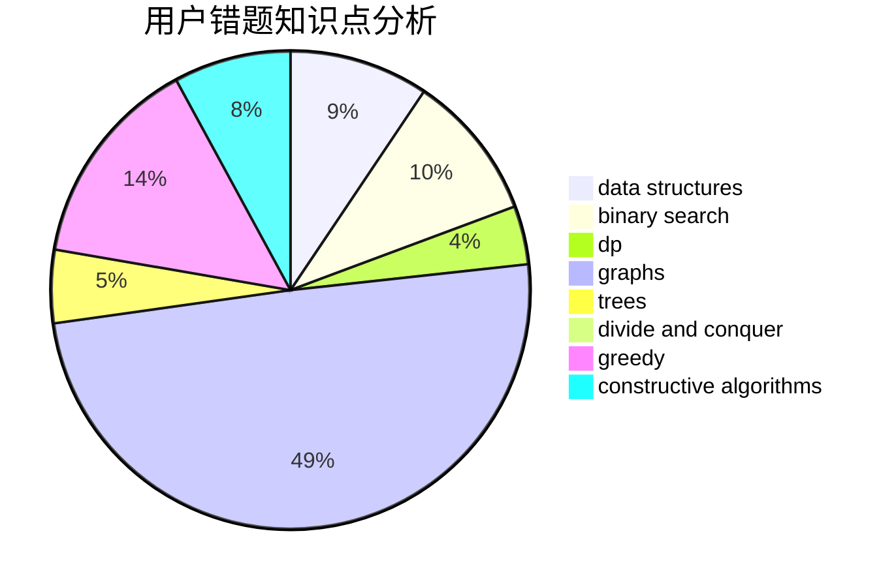

# baodaqing

<!-- tabs:start -->

#### **用户提交结果分析**

#### **用户做题类型偏好分析**

#### **用户错题知识点分析**

<!-- tabs:end -->
# 推荐题目
[1184C3](https://codeforces.com/contest/1184C/problem/3)		nan		  
[4A](https://codeforces.com/contest/4/problem/A)		brute force,
                        math		  
[827A](https://codeforces.com/contest/827/problem/A)		data structures,
                        greedy,
                        sortings,
                        strings		  
[370B](https://codeforces.com/contest/370/problem/B)		implementation		  
[319A](https://codeforces.com/contest/319/problem/A)		combinatorics,
                        math		  
[828E](https://codeforces.com/contest/828/problem/E)		dsu,graphs,sortings,trees		  
[981B](https://codeforces.com/contest/981/problem/B)		sortings		  
[489C](https://codeforces.com/contest/489/problem/C)		dp,
                        greedy,
                        implementation		  
[801D](https://codeforces.com/contest/801/problem/D)		dsu,graphs,sortings,trees		  
[668D](https://codeforces.com/contest/668/problem/D)		dsu,graphs,sortings,trees		  
