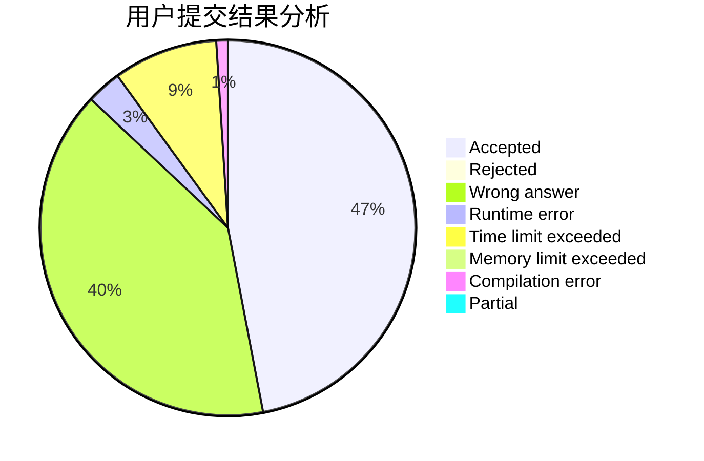
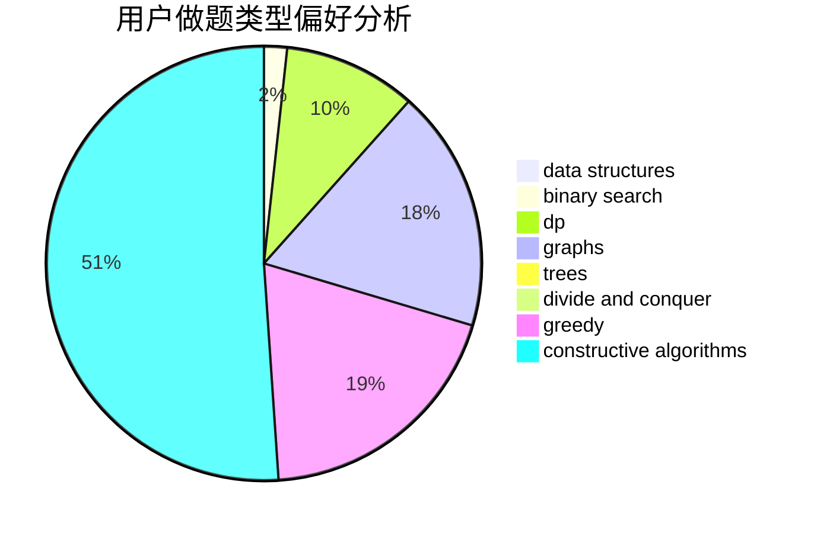
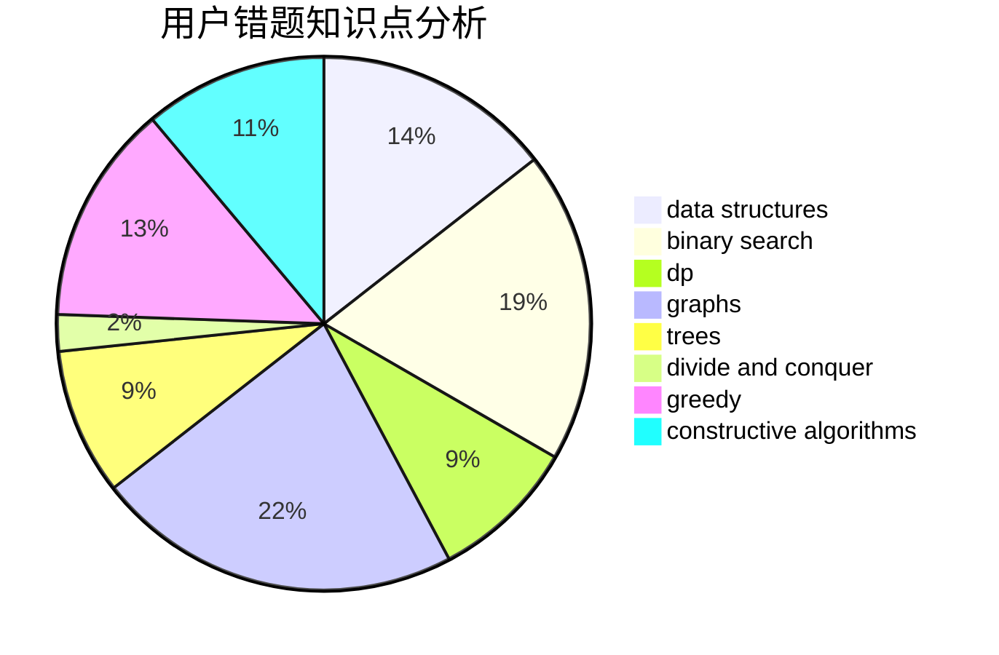

# basic_string

<!-- tabs:start -->

#### **用户提交结果分析**

#### **用户做题类型偏好分析**

#### **用户错题知识点分析**

<!-- tabs:end -->
# 推荐题目
[251B](https://codeforces.com/contest/251/problem/B)		implementation,
                        math		  
[284B](https://codeforces.com/contest/284/problem/B)		brute force,
                        implementation		  
[957C](https://codeforces.com/contest/957/problem/C)		dsu,graphs,sortings,trees		  
[1305D](https://codeforces.com/contest/1305/problem/D)		constructive algorithms,
                        dfs and similar,
                        interactive,
                        trees		  
[1343D](https://codeforces.com/contest/1343/problem/D)		brute force,
                        data structures,
                        greedy,
                        two pointers		  
[1139A](https://codeforces.com/contest/1139/problem/A)		implementation,
                        strings		  
[676A](https://codeforces.com/contest/676/problem/A)		constructive algorithms,
                        implementation		  
[594A](https://codeforces.com/contest/594/problem/A)		games		  
[1471C](https://codeforces.com/contest/1471/problem/C)		dsu,graphs,sortings,trees		  
[280A](https://codeforces.com/contest/280/problem/A)		geometry		  
