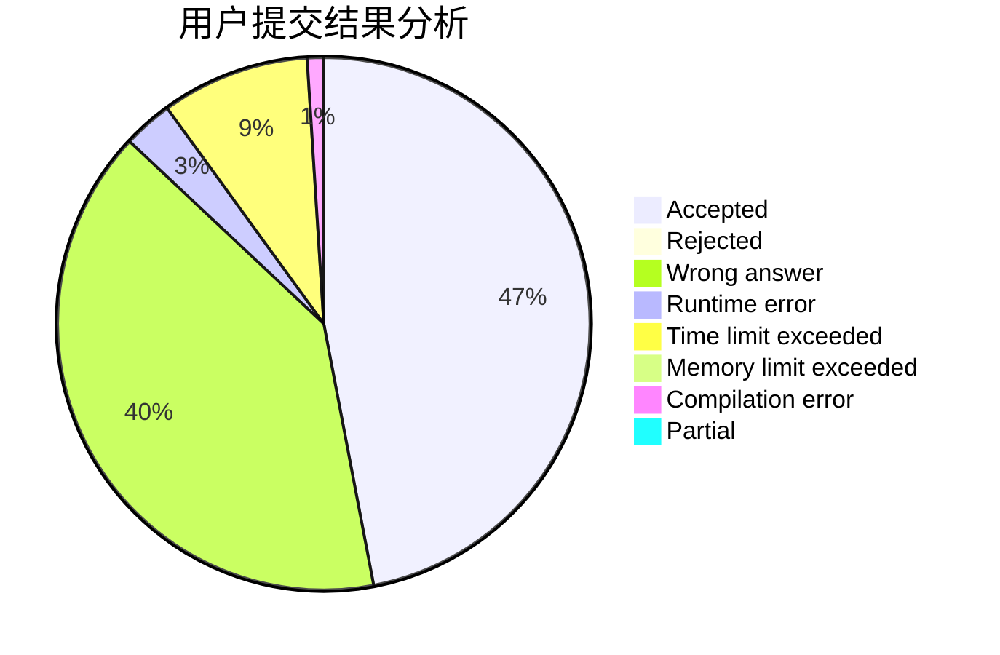
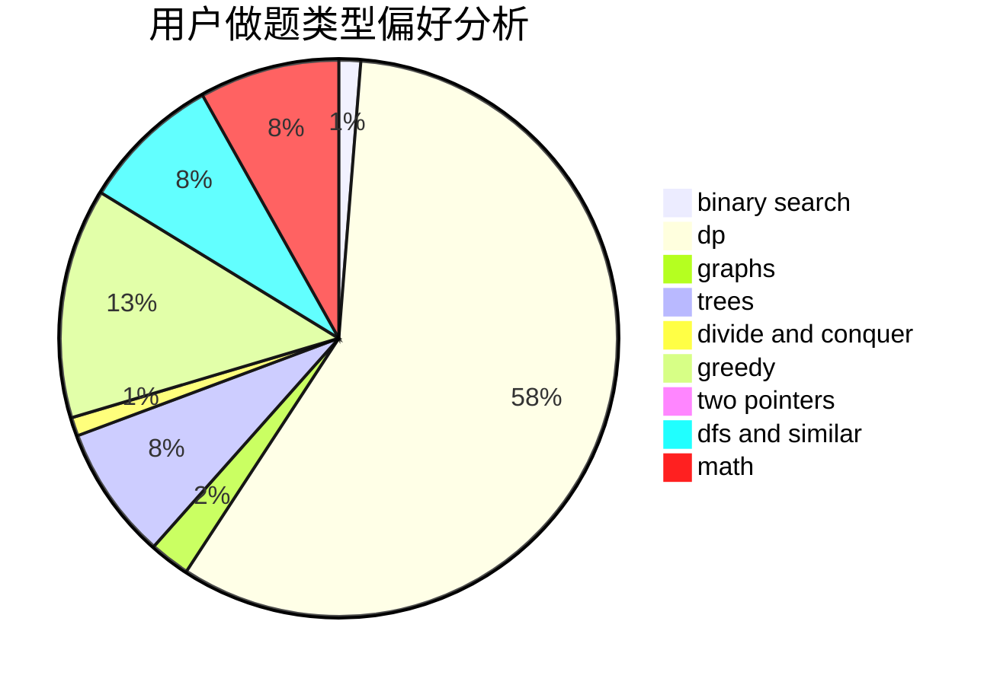

# basic_string

<!-- tabs:start -->

#### **用户提交结果分析**

#### **用户做题类型偏好分析**

<!-- tabs:end -->
# 推荐题目
[269D](https://codeforces.com/contest/269/problem/D)
[2A](https://codeforces.com/contest/2/problem/A)
[978F](https://codeforces.com/contest/978/problem/F)
[1314C](https://codeforces.com/contest/1314/problem/C)
[1350B](https://codeforces.com/contest/1350/problem/B)
[1140E](https://codeforces.com/contest/1140/problem/E)
[6E](https://codeforces.com/contest/6/problem/E)
[612C](https://codeforces.com/contest/612/problem/C)
[1479E](https://codeforces.com/contest/1479/problem/E)
[295E](https://codeforces.com/contest/295/problem/E)
