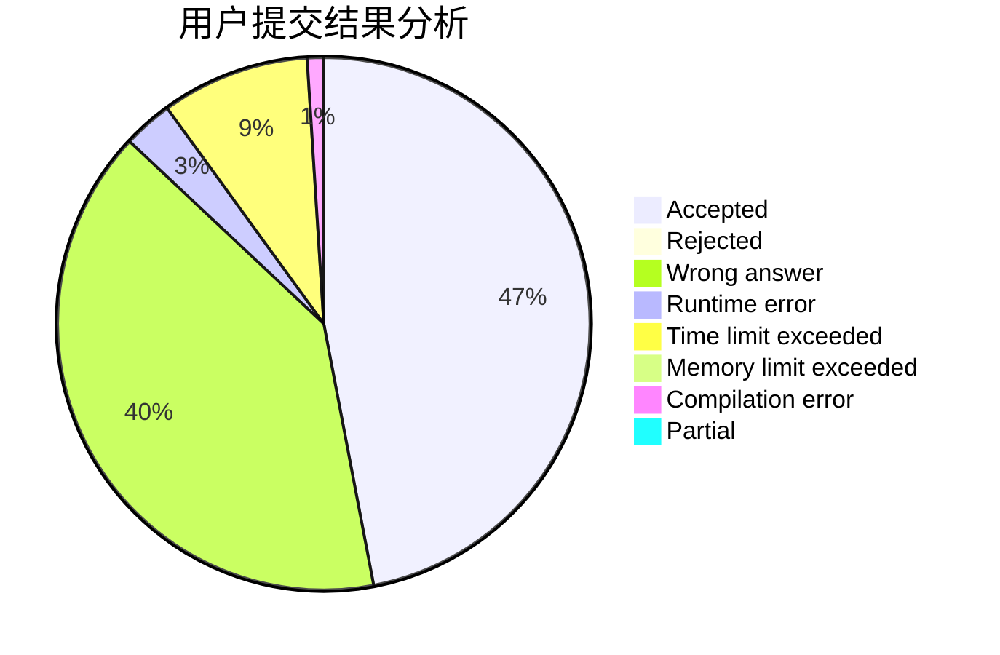
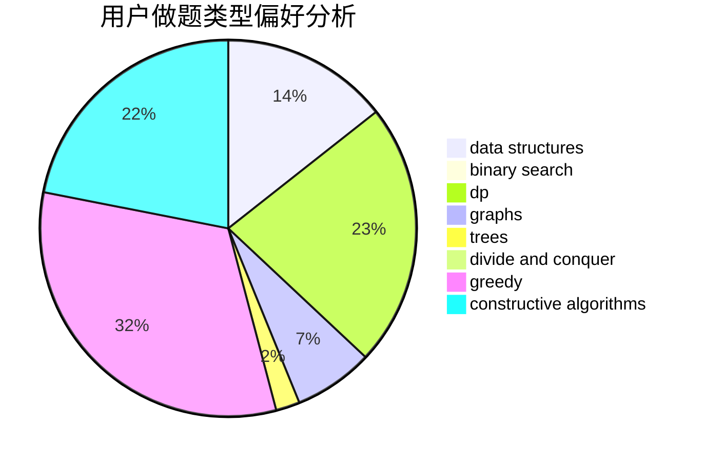
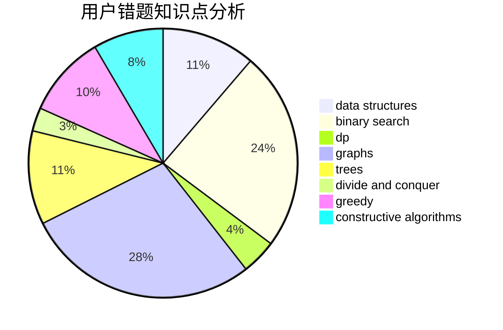

# basic_string

<!-- tabs:start -->

#### **用户提交结果分析**

#### **用户做题类型偏好分析**

#### **用户错题知识点分析**

<!-- tabs:end -->
# 推荐题目
[269D](https://codeforces.com/contest/269/problem/D)		data structures,
                        dp,
                        graphs,
                        sortings		  
[2A](https://codeforces.com/contest/2/problem/A)		hashing,
                        implementation		  
[978F](https://codeforces.com/contest/978/problem/F)		binary search,
                        data structures,
                        implementation		  
[1314C](https://codeforces.com/contest/1314/problem/C)		dsu,graphs,sortings,trees		  
[1350B](https://codeforces.com/contest/1350/problem/B)		dp,
                        math,
                        number theory		  
[1140E](https://codeforces.com/contest/1140/problem/E)		combinatorics,
                        divide and conquer,
                        dp		  
[6E](https://codeforces.com/contest/6/problem/E)		binary search,
                        data structures,
                        dsu,
                        trees,
                        two pointers		  
[612C](https://codeforces.com/contest/612/problem/C)		data structures,
                        expression parsing,
                        math		  
[1479E](https://codeforces.com/contest/1479/problem/E)		dp,
                        fft,
                        math,
                        number theory,
                        probabilities		  
[295E](https://codeforces.com/contest/295/problem/E)		data structures		  
