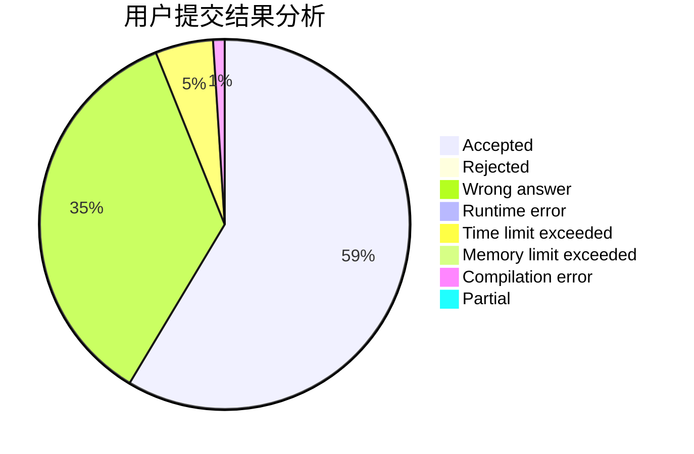
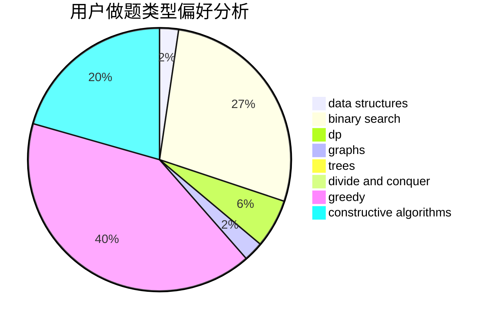
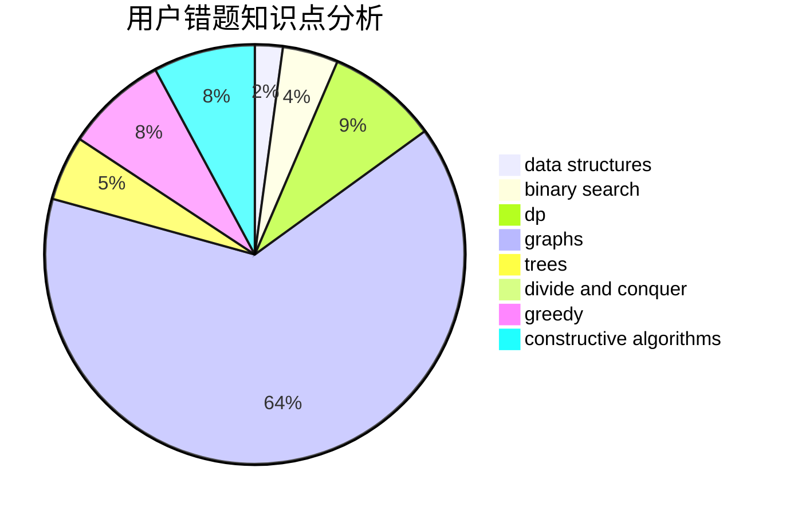

# bdzxt

<!-- tabs:start -->

#### **用户提交结果分析**

#### **用户做题类型偏好分析**

#### **用户错题知识点分析**

<!-- tabs:end -->
# 推荐题目
[893D](https://codeforces.com/contest/893/problem/D)		data structures,
                        dp,
                        greedy,
                        implementation		  
[1207G](https://codeforces.com/contest/1207/problem/G)		data structures,
                        dfs and similar,
                        hashing,
                        string suffix structures,
                        strings,
                        trees		  
[291A](https://codeforces.com/contest/291/problem/A)		*special problem,
                        implementation,
                        sortings		  
[819D](https://codeforces.com/contest/819/problem/D)		number theory		  
[460E](https://codeforces.com/contest/460/problem/E)		brute force,
                        geometry,
                        math,
                        sortings		  
[79D](https://codeforces.com/contest/79/problem/D)		bitmasks,
                        dp,
                        shortest paths		  
[593D](https://codeforces.com/contest/593/problem/D)		data structures,
                        dfs and similar,
                        graphs,
                        math,
                        trees		  
[386C](https://codeforces.com/contest/386/problem/C)		dp,
                        strings,
                        two pointers		  
[208C](https://codeforces.com/contest/208/problem/C)		dp,
                        graphs,
                        shortest paths		  
[546E](https://codeforces.com/contest/546/problem/E)		flows,
                        graphs,
                        math		  
