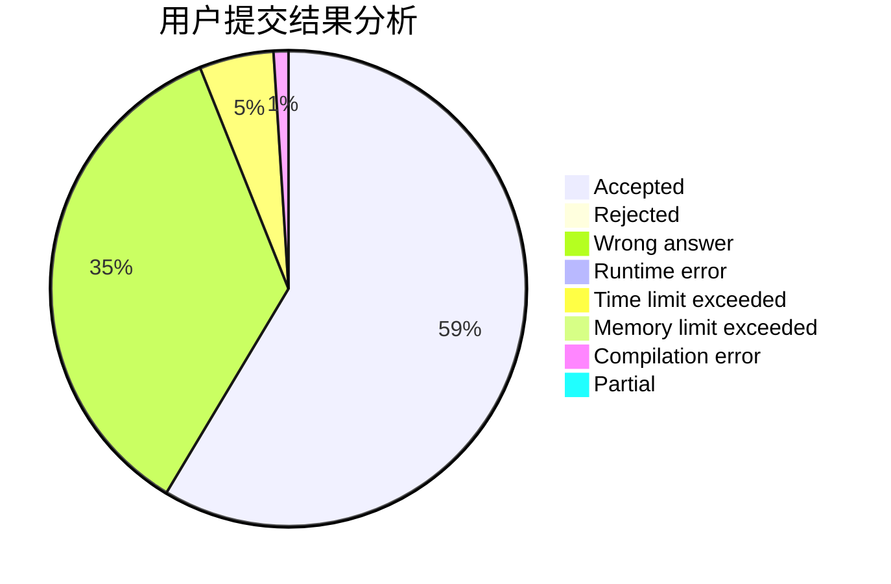
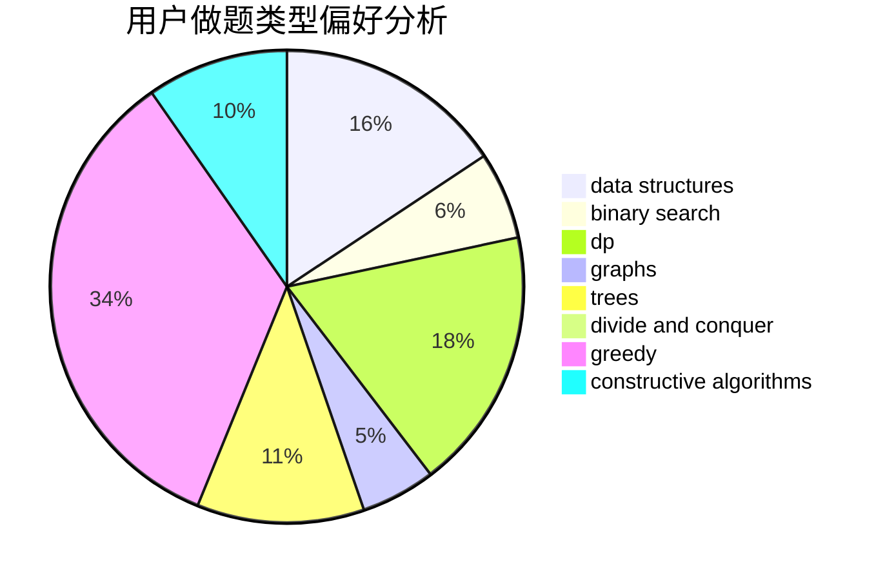
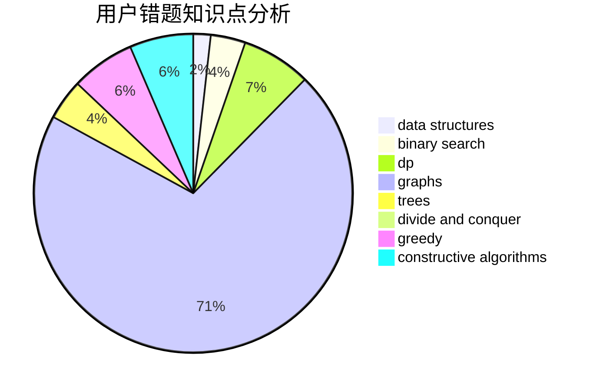

# bdzxt

<!-- tabs:start -->

#### **用户提交结果分析**

#### **用户做题类型偏好分析**

#### **用户错题知识点分析**

<!-- tabs:end -->
# 推荐题目
[872B](https://codeforces.com/contest/872/problem/B)		dsu,graphs,sortings,trees		  
[1203C](https://codeforces.com/contest/1203/problem/C)		implementation,
                        math		  
[276D](https://codeforces.com/contest/276/problem/D)		bitmasks,
                        dp,
                        greedy,
                        implementation,
                        math		  
[803E](https://codeforces.com/contest/803/problem/E)		dp,
                        graphs		  
[439D](https://codeforces.com/contest/439/problem/D)		binary search,
                        sortings,
                        ternary search,
                        two pointers		  
[780H](https://codeforces.com/contest/780/problem/H)		binary search,
                        geometry,
                        implementation,
                        two pointers		  
[573E](https://codeforces.com/contest/573/problem/E)		data structures,
                        greedy		  
[359C](https://codeforces.com/contest/359/problem/C)		math,
                        number theory		  
[181A](https://codeforces.com/contest/181/problem/A)		brute force,
                        geometry,
                        implementation		  
[521A](https://codeforces.com/contest/521/problem/A)		dsu,graphs,sortings,trees		  
