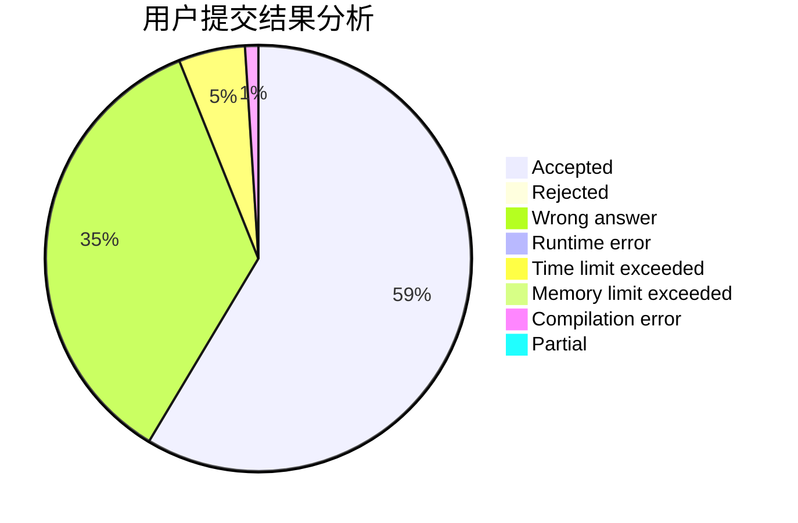
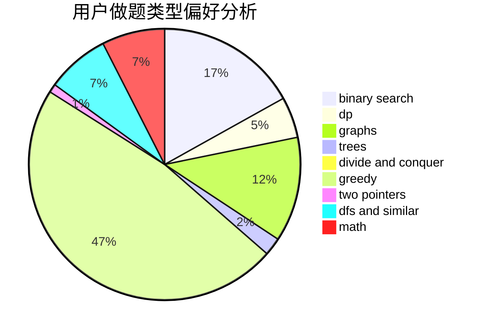

# bdzxt

<!-- tabs:start -->

#### **用户提交结果分析**

#### **用户做题类型偏好分析**

<!-- tabs:end -->
# 推荐题目
[893D](https://codeforces.com/contest/893/problem/D)
[1207G](https://codeforces.com/contest/1207/problem/G)
[291A](https://codeforces.com/contest/291/problem/A)
[819D](https://codeforces.com/contest/819/problem/D)
[460E](https://codeforces.com/contest/460/problem/E)
[79D](https://codeforces.com/contest/79/problem/D)
[593D](https://codeforces.com/contest/593/problem/D)
[386C](https://codeforces.com/contest/386/problem/C)
[208C](https://codeforces.com/contest/208/problem/C)
[546E](https://codeforces.com/contest/546/problem/E)
