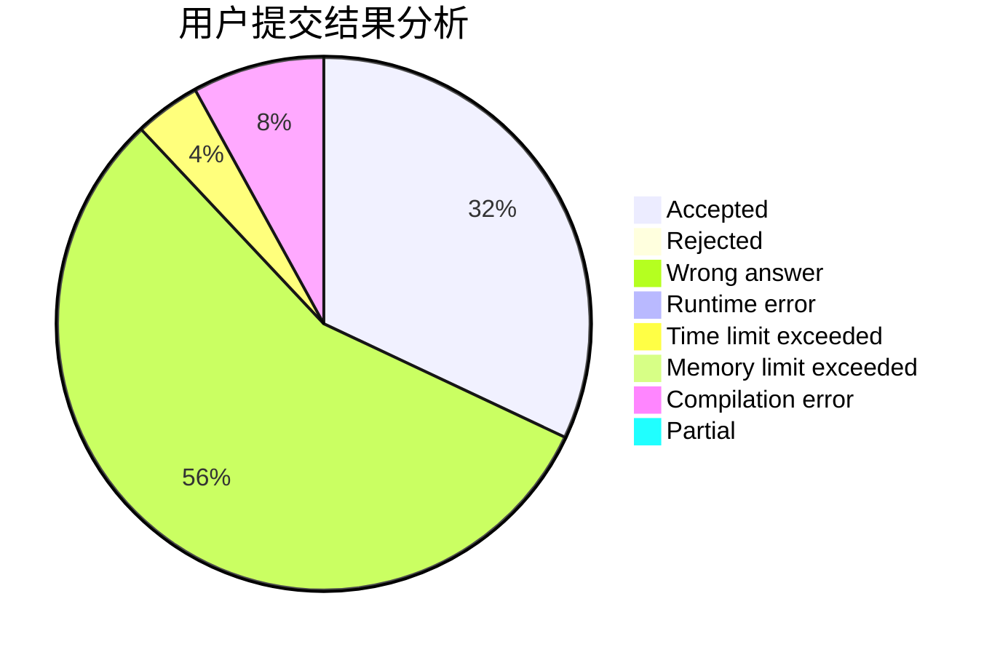
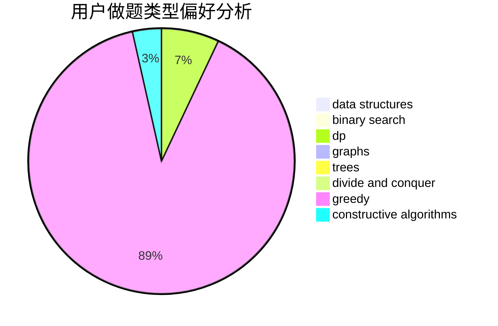
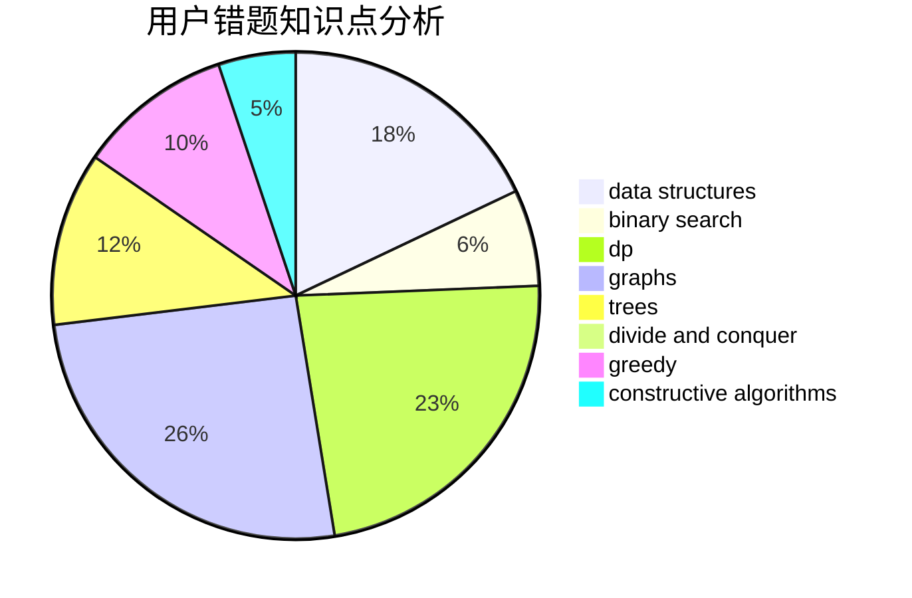

# Andrew_zch

<!-- tabs:start -->

#### **用户提交结果分析**

#### **用户做题类型偏好分析**

#### **用户错题知识点分析**

<!-- tabs:end -->
# 推荐题目
[316E2](https://codeforces.com/contest/316E/problem/2)		data structures,
                        math		  
[297D](https://codeforces.com/contest/297/problem/D)		constructive algorithms		  
[1033B](https://codeforces.com/contest/1033/problem/B)		math,
                        number theory		  
[316G1](https://codeforces.com/contest/316G/problem/1)		hashing,
                        strings		  
[316E3](https://codeforces.com/contest/316E/problem/3)		data structures,
                        math		  
[158B](https://codeforces.com/contest/158/problem/B)		*special problem,
                        greedy,
                        implementation		  
[1267F](https://codeforces.com/contest/1267/problem/F)		graphs		  
[1362F](https://codeforces.com/contest/1362/problem/F)		dsu,graphs,sortings,trees		  
[1167B](https://codeforces.com/contest/1167/problem/B)		brute force,
                        divide and conquer,
                        interactive,
                        math		  
[316D3](https://codeforces.com/contest/316D/problem/3)		dp,
                        math		  
