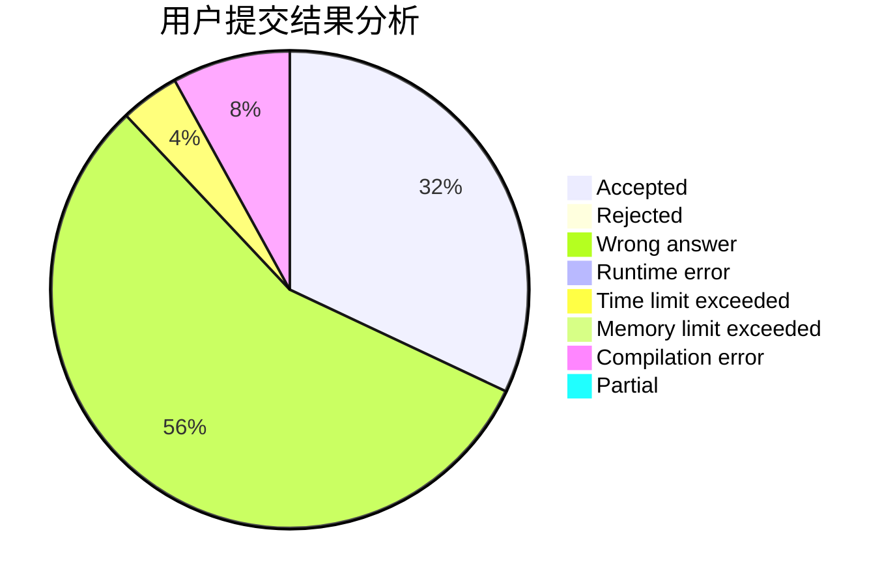
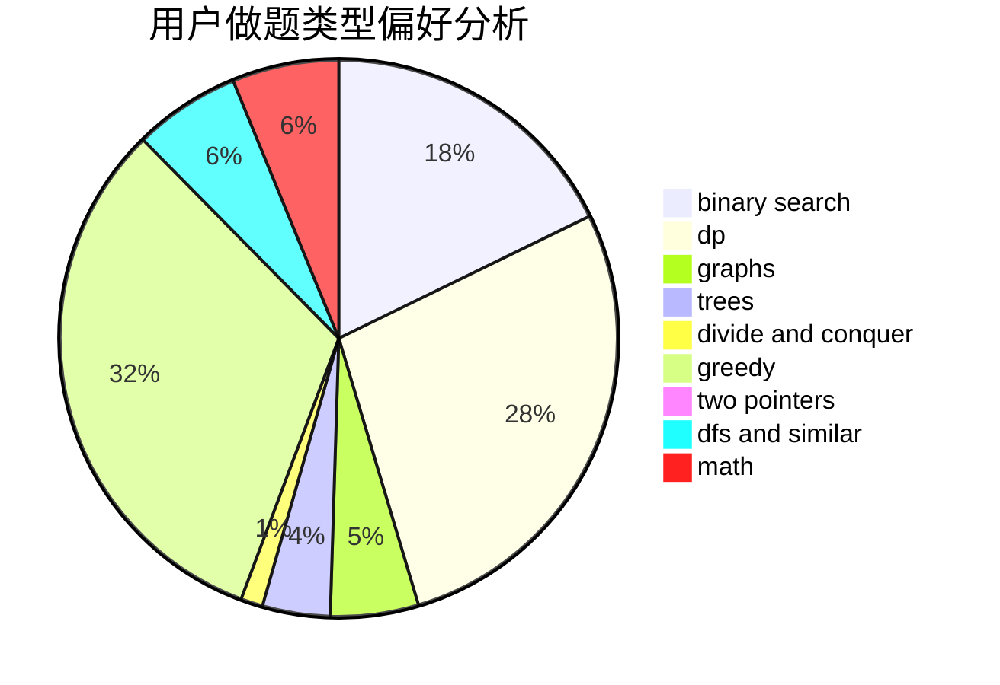

# Andrew_zch

<!-- tabs:start -->

#### **用户提交结果分析**

#### **用户做题类型偏好分析**

<!-- tabs:end -->
# 推荐题目
[343A](https://codeforces.com/contest/343/problem/A)
[314C](https://codeforces.com/contest/314/problem/C)
[1033E](https://codeforces.com/contest/1033/problem/E)
[344A](https://codeforces.com/contest/344/problem/A)
[343B](https://codeforces.com/contest/343/problem/B)
[17E](https://codeforces.com/contest/17/problem/E)
[1276B](https://codeforces.com/contest/1276/problem/B)
[13701](https://codeforces.com/contest/1370/problem/1)
[11721](https://codeforces.com/contest/1172/problem/1)
[342C](https://codeforces.com/contest/342/problem/C)
