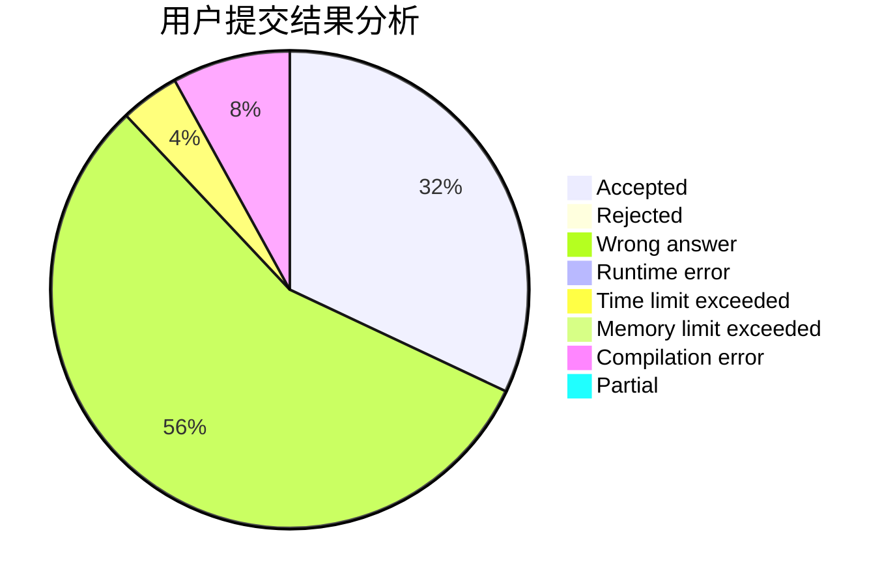
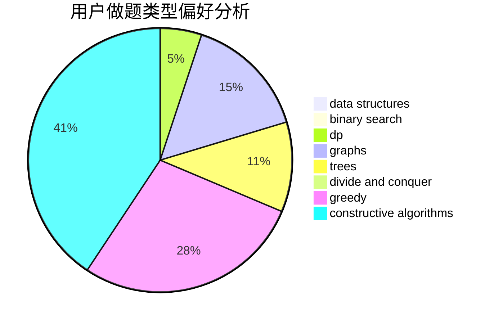
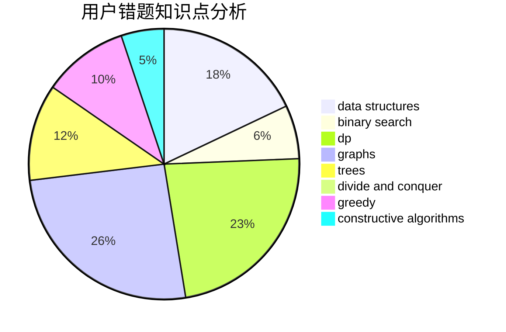

# Andrew_zch

<!-- tabs:start -->

#### **用户提交结果分析**

#### **用户做题类型偏好分析**

#### **用户错题知识点分析**

<!-- tabs:end -->
# 推荐题目
[343A](https://codeforces.com/contest/343/problem/A)		math,
                        number theory		  
[314C](https://codeforces.com/contest/314/problem/C)		data structures,
                        dp		  
[1033E](https://codeforces.com/contest/1033/problem/E)		binary search,
                        constructive algorithms,
                        dfs and similar,
                        graphs,
                        interactive		  
[344A](https://codeforces.com/contest/344/problem/A)		implementation		  
[343B](https://codeforces.com/contest/343/problem/B)		data structures,
                        greedy,
                        implementation		  
[17E](https://codeforces.com/contest/17/problem/E)		strings		  
[1276B](https://codeforces.com/contest/1276/problem/B)		combinatorics,
                        dfs and similar,
                        dsu,
                        graphs		  
[13701](https://codeforces.com/contest/1370/problem/1)		dsu,graphs,sortings,trees		  
[11721](https://codeforces.com/contest/1172/problem/1)		dsu,graphs,sortings,trees		  
[342C](https://codeforces.com/contest/342/problem/C)		geometry		  
