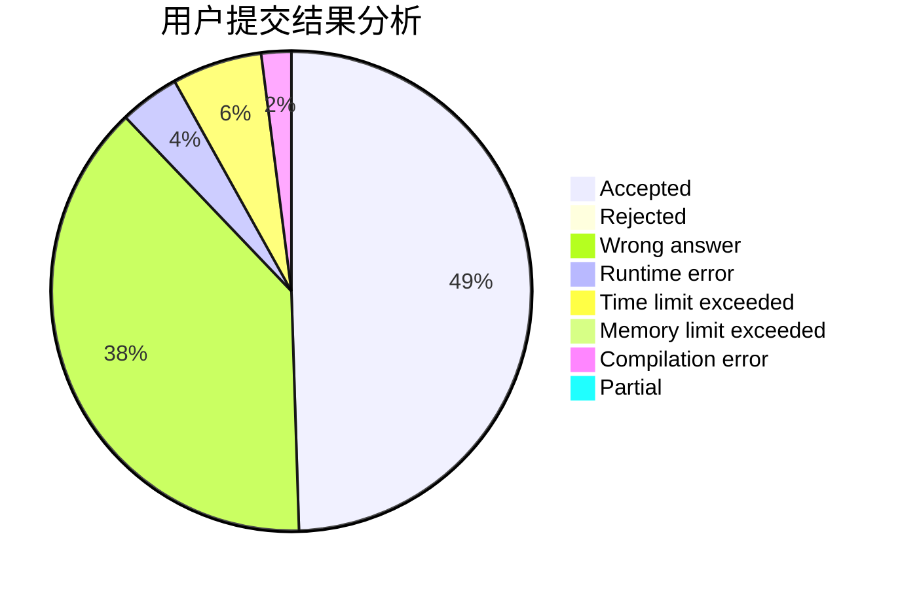
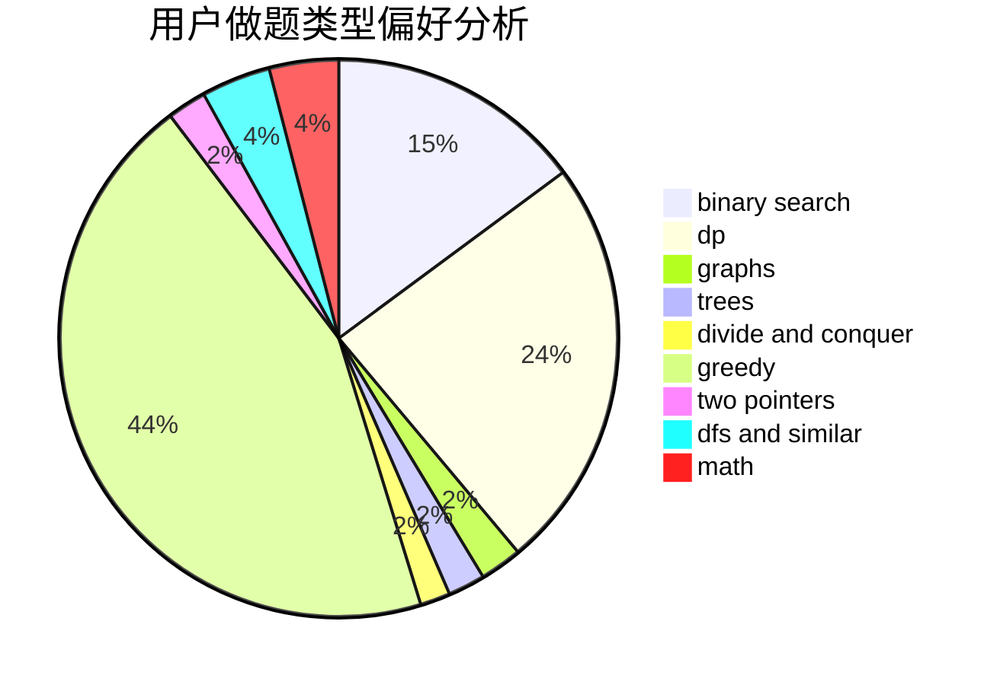

# beacon_cwk

<!-- tabs:start -->

#### **用户提交结果分析**

#### **用户做题类型偏好分析**

<!-- tabs:end -->
# 推荐题目
[828C](https://codeforces.com/contest/828/problem/C)
[383E](https://codeforces.com/contest/383/problem/E)
[724F](https://codeforces.com/contest/724/problem/F)
[515D](https://codeforces.com/contest/515/problem/D)
[1198F](https://codeforces.com/contest/1198/problem/F)
[845E](https://codeforces.com/contest/845/problem/E)
[988F](https://codeforces.com/contest/988/problem/F)
[847F](https://codeforces.com/contest/847/problem/F)
[703A](https://codeforces.com/contest/703/problem/A)
[1432A](https://codeforces.com/contest/1432/problem/A)
