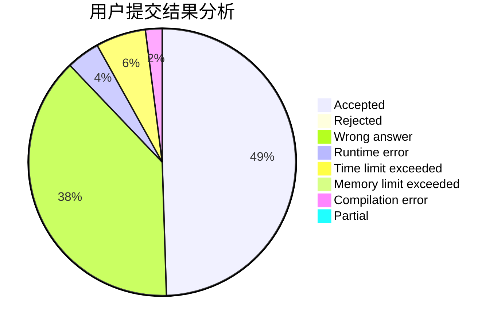
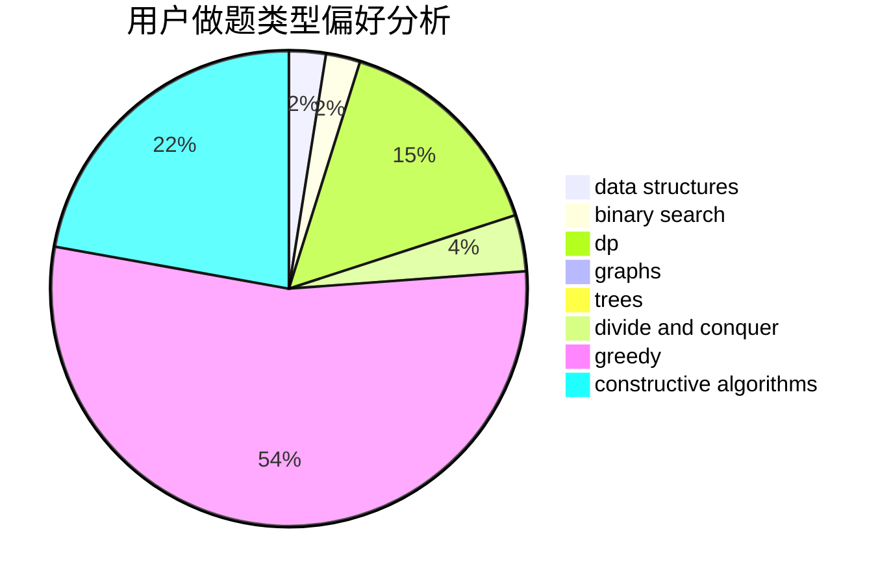
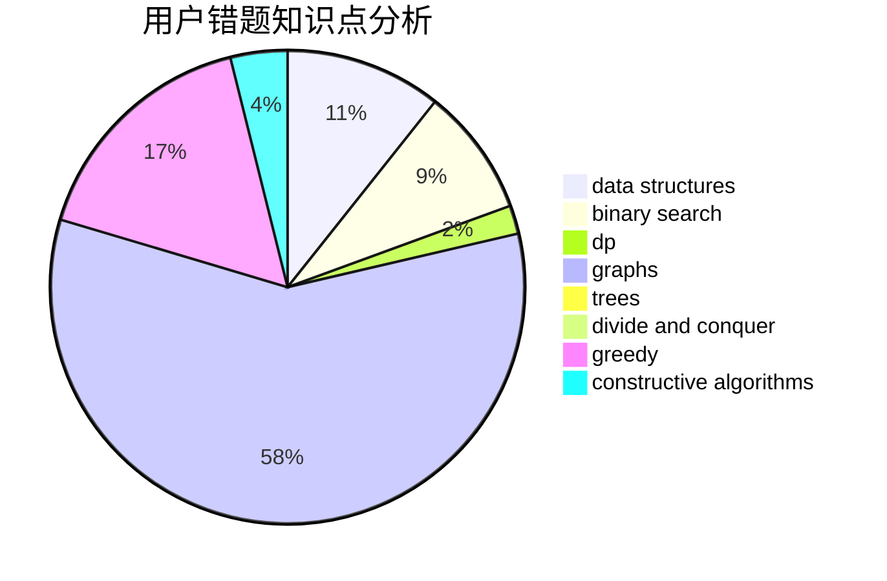

# beacon_cwk

<!-- tabs:start -->

#### **用户提交结果分析**

#### **用户做题类型偏好分析**

#### **用户错题知识点分析**

<!-- tabs:end -->
# 推荐题目
[828C](https://codeforces.com/contest/828/problem/C)		dsu,graphs,sortings,trees		  
[383E](https://codeforces.com/contest/383/problem/E)		combinatorics,
                        divide and conquer,
                        dp		  
[724F](https://codeforces.com/contest/724/problem/F)		combinatorics,
                        dp,
                        trees		  
[515D](https://codeforces.com/contest/515/problem/D)		constructive algorithms,
                        greedy		  
[1198F](https://codeforces.com/contest/1198/problem/F)		greedy,
                        number theory,
                        probabilities		  
[845E](https://codeforces.com/contest/845/problem/E)		binary search,
                        data structures		  
[988F](https://codeforces.com/contest/988/problem/F)		dp		  
[847F](https://codeforces.com/contest/847/problem/F)		greedy,
                        sortings		  
[703A](https://codeforces.com/contest/703/problem/A)		implementation		  
[1432A](https://codeforces.com/contest/1432/problem/A)		dsu,graphs,sortings,trees		  
