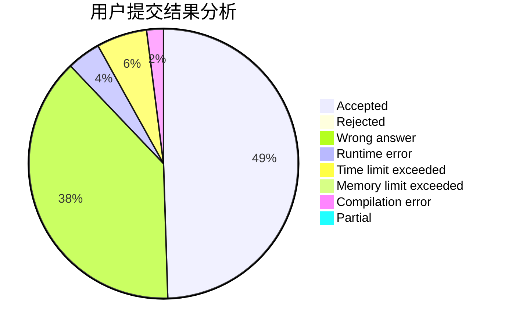
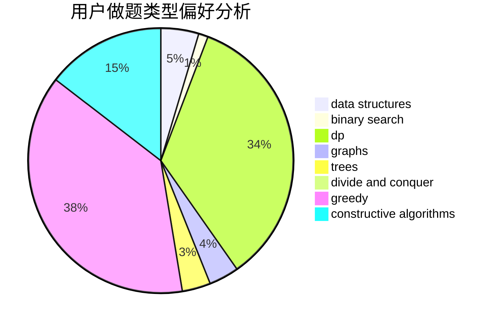
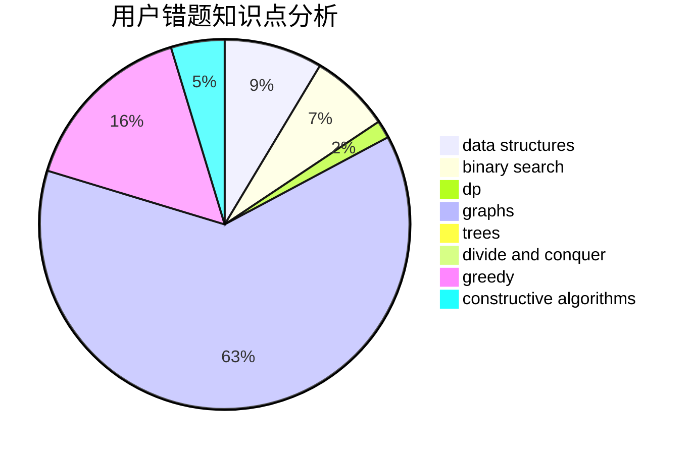

# beacon_cwk

<!-- tabs:start -->

#### **用户提交结果分析**

#### **用户做题类型偏好分析**

#### **用户错题知识点分析**

<!-- tabs:end -->
# 推荐题目
[810C](https://codeforces.com/contest/810/problem/C)		dsu,graphs,sortings,trees		  
[358D](https://codeforces.com/contest/358/problem/D)		dp,
                        greedy		  
[706A](https://codeforces.com/contest/706/problem/A)		brute force,
                        geometry,
                        implementation		  
[496A](https://codeforces.com/contest/496/problem/A)		brute force,
                        implementation,
                        math		  
[1194D](https://codeforces.com/contest/1194/problem/D)		games,
                        math		  
[827B](https://codeforces.com/contest/827/problem/B)		constructive algorithms,
                        greedy,
                        implementation,
                        trees		  
[967C](https://codeforces.com/contest/967/problem/C)		dsu,graphs,sortings,trees		  
[82A](https://codeforces.com/contest/82/problem/A)		implementation,
                        math		  
[679B](https://codeforces.com/contest/679/problem/B)		binary search,
                        dp,
                        greedy		  
[1423K](https://codeforces.com/contest/1423/problem/K)		binary search,
                        math,
                        number theory,
                        two pointers		  
