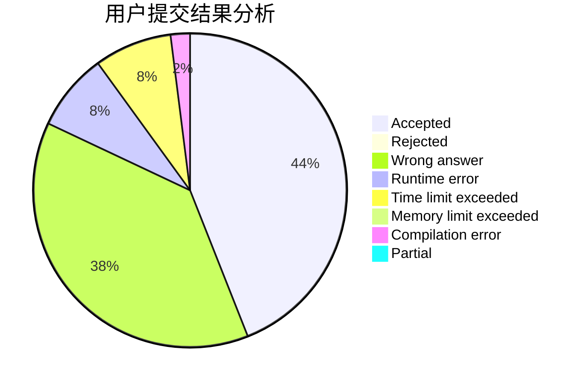
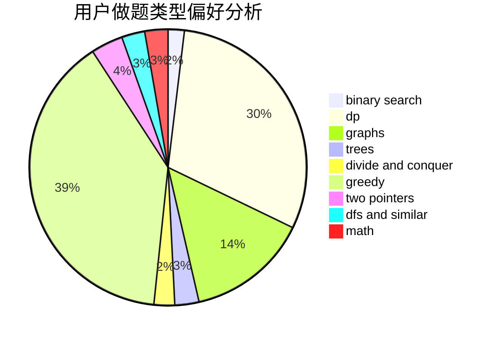

# bestBrain

<!-- tabs:start -->

#### **用户提交结果分析**

#### **用户做题类型偏好分析**

<!-- tabs:end -->
# 推荐题目
[306D](https://codeforces.com/contest/306/problem/D)
[1283B](https://codeforces.com/contest/1283/problem/B)
[91B](https://codeforces.com/contest/91/problem/B)
[948C](https://codeforces.com/contest/948/problem/C)
[1395F](https://codeforces.com/contest/1395/problem/F)
[36C](https://codeforces.com/contest/36/problem/C)
[577A](https://codeforces.com/contest/577/problem/A)
[601C](https://codeforces.com/contest/601/problem/C)
[680B](https://codeforces.com/contest/680/problem/B)
[978A](https://codeforces.com/contest/978/problem/A)
