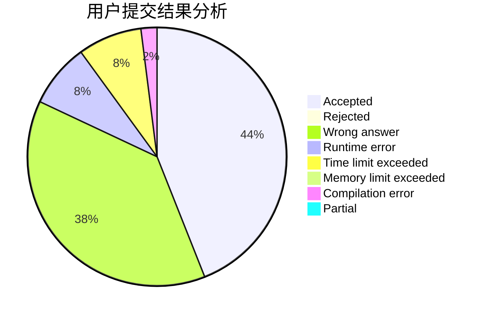
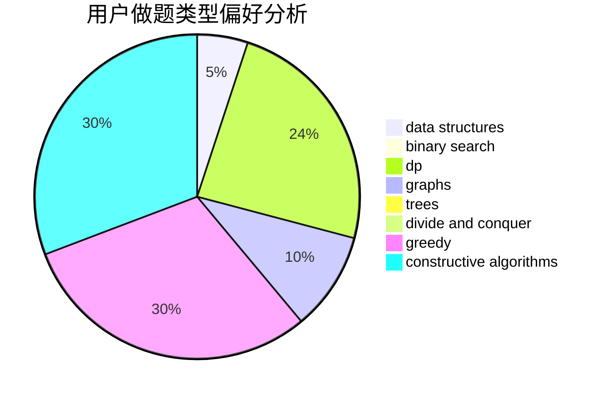

# bestBrain

<!-- tabs:start -->

#### **用户提交结果分析**

#### **用户做题类型偏好分析**

#### **用户错题知识点分析**

<!-- tabs:end -->
# 推荐题目
[306D](https://codeforces.com/contest/306/problem/D)		constructive algorithms,
                        geometry		  
[1283B](https://codeforces.com/contest/1283/problem/B)		math		  
[91B](https://codeforces.com/contest/91/problem/B)		binary search,
                        data structures		  
[948C](https://codeforces.com/contest/948/problem/C)		dsu,graphs,sortings,trees		  
[1395F](https://codeforces.com/contest/1395/problem/F)		dsu,graphs,sortings,trees		  
[36C](https://codeforces.com/contest/36/problem/C)		geometry,
                        implementation		  
[577A](https://codeforces.com/contest/577/problem/A)		implementation,
                        number theory		  
[601C](https://codeforces.com/contest/601/problem/C)		dp,
                        math,
                        probabilities		  
[680B](https://codeforces.com/contest/680/problem/B)		constructive algorithms,
                        implementation		  
[978A](https://codeforces.com/contest/978/problem/A)		implementation		  
