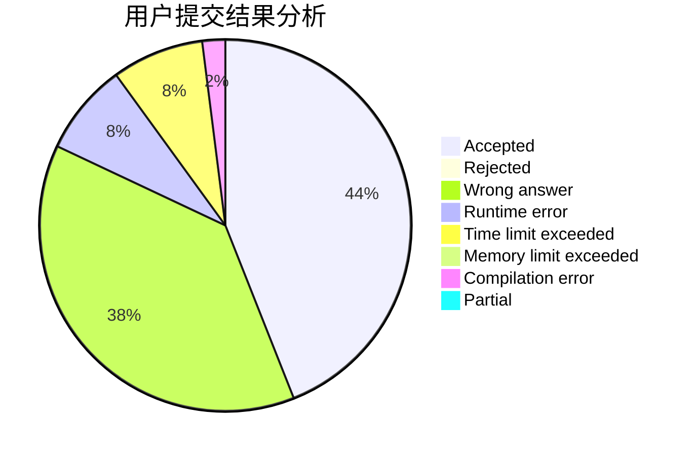
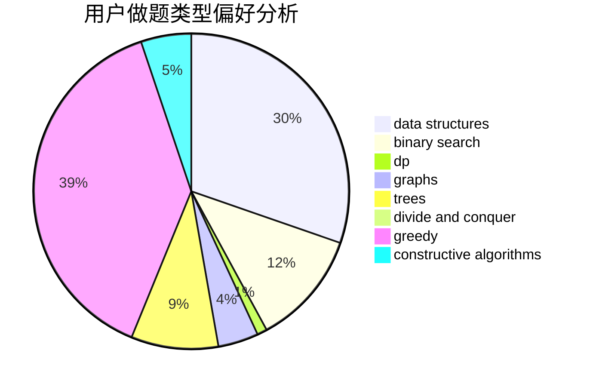

# bestBrain

<!-- tabs:start -->

#### **用户提交结果分析**

#### **用户做题类型偏好分析**

#### **用户错题知识点分析**

<!-- tabs:end -->
# 推荐题目
[292A](https://codeforces.com/contest/292/problem/A)		implementation		  
[1276F](https://codeforces.com/contest/1276/problem/F)		string suffix structures		  
[906B](https://codeforces.com/contest/906/problem/B)		brute force,
                        constructive algorithms,
                        math		  
[924E](https://codeforces.com/contest/924/problem/E)		nan		  
[1385F](https://codeforces.com/contest/1385/problem/F)		data structures,
                        greedy,
                        implementation,
                        trees		  
[343B](https://codeforces.com/contest/343/problem/B)		data structures,
                        greedy,
                        implementation		  
[551E](https://codeforces.com/contest/551/problem/E)		binary search,
                        data structures,
                        implementation		  
[581B](https://codeforces.com/contest/581/problem/B)		implementation,
                        math		  
[660A](https://codeforces.com/contest/660/problem/A)		greedy,
                        implementation,
                        math,
                        number theory		  
[956C](https://codeforces.com/contest/956/problem/C)		dsu,graphs,sortings,trees		  
