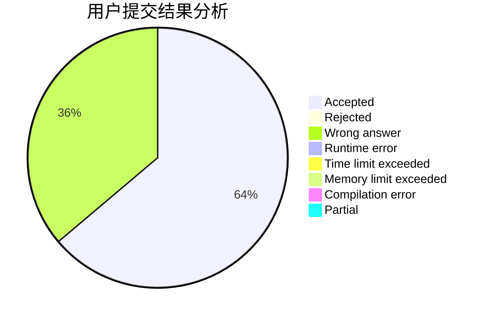
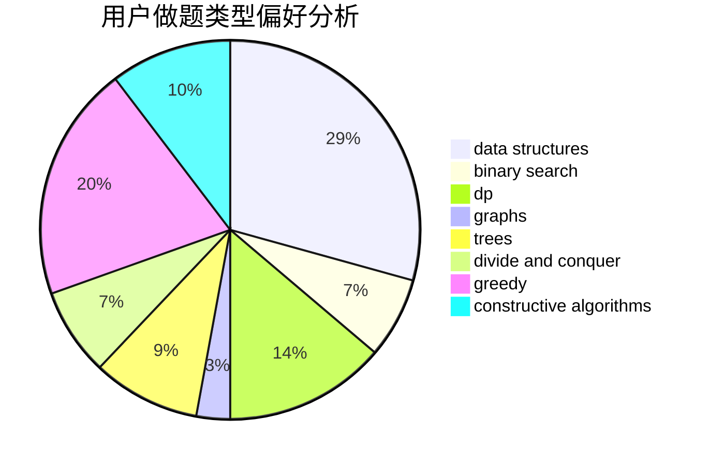
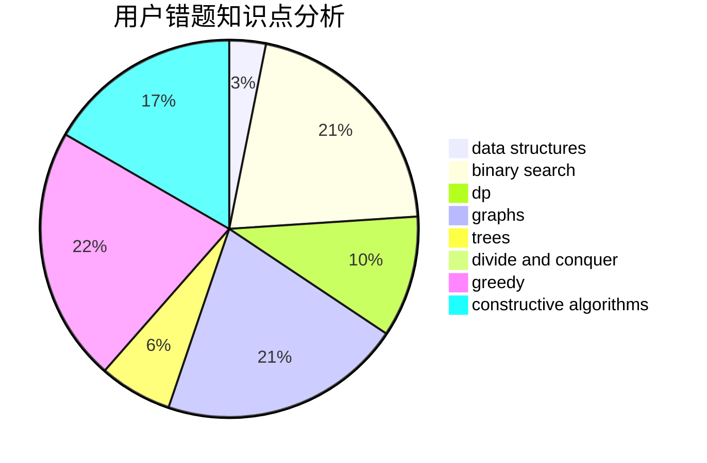

# bezime

<!-- tabs:start -->

#### **用户提交结果分析**

#### **用户做题类型偏好分析**

#### **用户错题知识点分析**

<!-- tabs:end -->
# 推荐题目
[845D](https://codeforces.com/contest/845/problem/D)		data structures,
                        dp,
                        greedy		  
[735C](https://codeforces.com/contest/735/problem/C)		combinatorics,
                        constructive algorithms,
                        greedy,
                        math		  
[44G](https://codeforces.com/contest/44/problem/G)		data structures,
                        implementation		  
[35A](https://codeforces.com/contest/35/problem/A)		implementation		  
[166A](https://codeforces.com/contest/166/problem/A)		binary search,
                        implementation,
                        sortings		  
[508A](https://codeforces.com/contest/508/problem/A)		brute force		  
[1161A](https://codeforces.com/contest/1161/problem/A)		dsu,graphs,sortings,trees		  
[1016D](https://codeforces.com/contest/1016/problem/D)		constructive algorithms,
                        flows,
                        math		  
[1072D](https://codeforces.com/contest/1072/problem/D)		dsu,graphs,sortings,trees		  
[226B](https://codeforces.com/contest/226/problem/B)		greedy		  
