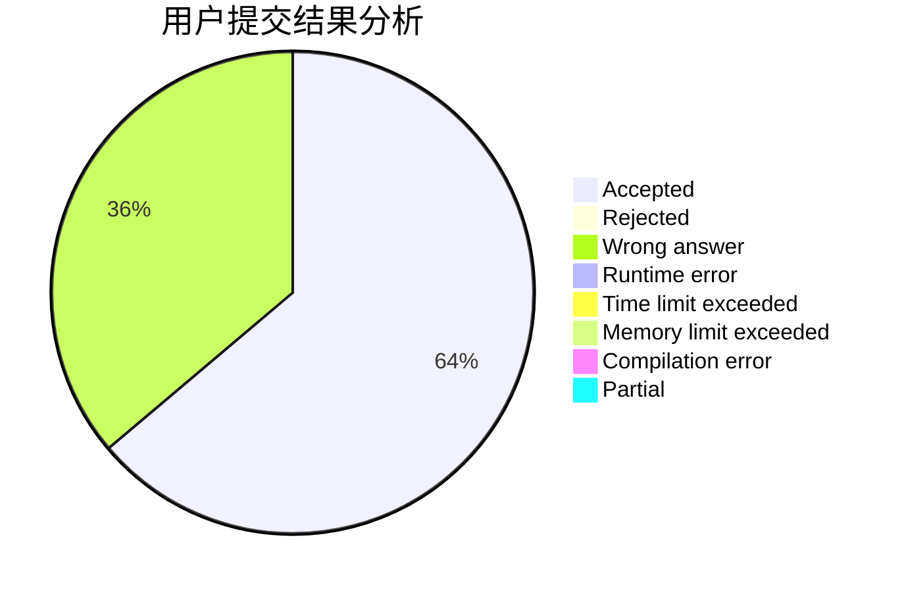
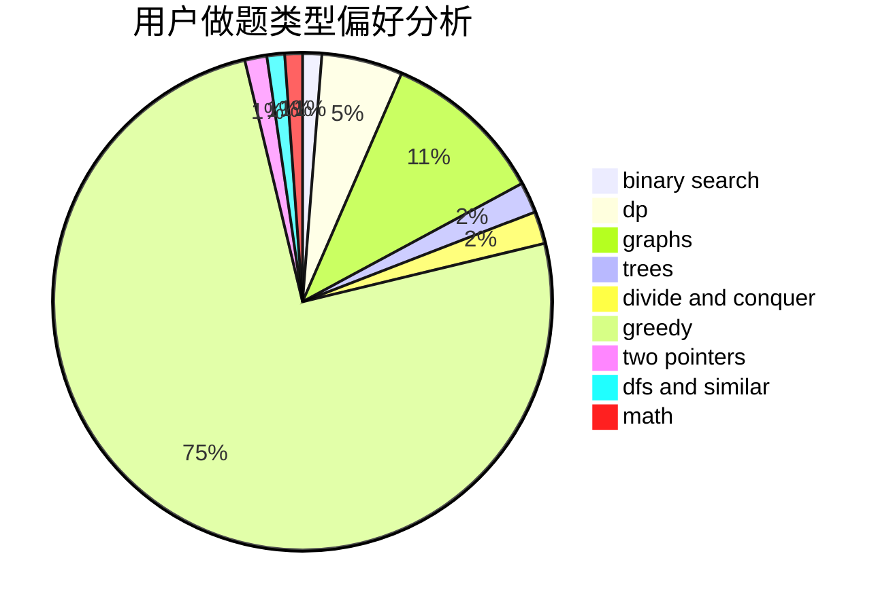

# bezime

<!-- tabs:start -->

#### **用户提交结果分析**

#### **用户做题类型偏好分析**

<!-- tabs:end -->
# 推荐题目
[845D](https://codeforces.com/contest/845/problem/D)
[735C](https://codeforces.com/contest/735/problem/C)
[44G](https://codeforces.com/contest/44/problem/G)
[35A](https://codeforces.com/contest/35/problem/A)
[166A](https://codeforces.com/contest/166/problem/A)
[508A](https://codeforces.com/contest/508/problem/A)
[1161A](https://codeforces.com/contest/1161/problem/A)
[1016D](https://codeforces.com/contest/1016/problem/D)
[1072D](https://codeforces.com/contest/1072/problem/D)
[226B](https://codeforces.com/contest/226/problem/B)
