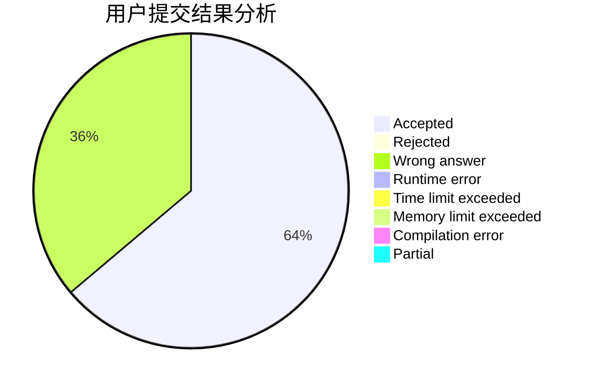
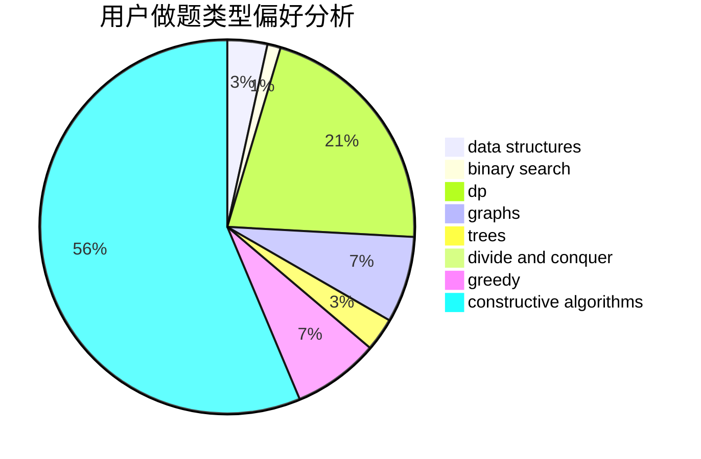
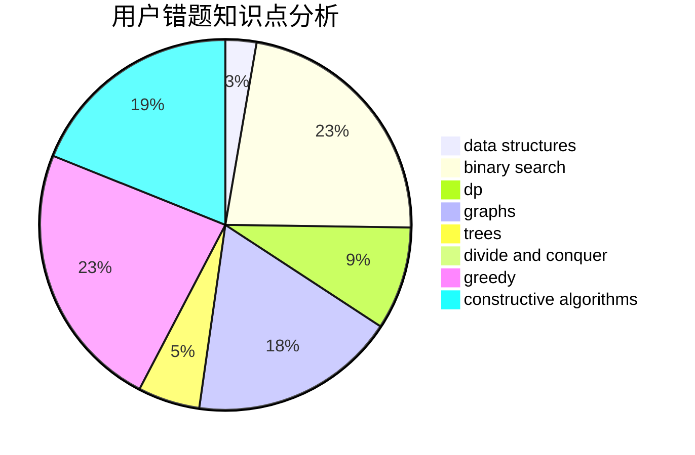

# bezime

<!-- tabs:start -->

#### **用户提交结果分析**

#### **用户做题类型偏好分析**

#### **用户错题知识点分析**

<!-- tabs:end -->
# 推荐题目
[827A](https://codeforces.com/contest/827/problem/A)		data structures,
                        greedy,
                        sortings,
                        strings		  
[717I](https://codeforces.com/contest/717/problem/I)		geometry		  
[429B](https://codeforces.com/contest/429/problem/B)		dp		  
[331E1](https://codeforces.com/contest/331E/problem/1)		constructive algorithms,
                        graphs,
                        implementation		  
[1510I](https://codeforces.com/contest/1510/problem/I)		greedy,
                        interactive,
                        math,
                        probabilities		  
[487A](https://codeforces.com/contest/487/problem/A)		binary search,
                        brute force,
                        implementation		  
[1158B](https://codeforces.com/contest/1158/problem/B)		constructive algorithms,
                        math,
                        strings		  
[1016A](https://codeforces.com/contest/1016/problem/A)		greedy,
                        implementation,
                        math		  
[1072A](https://codeforces.com/contest/1072/problem/A)		dsu,graphs,sortings,trees		  
[201C](https://codeforces.com/contest/201/problem/C)		dp		  
