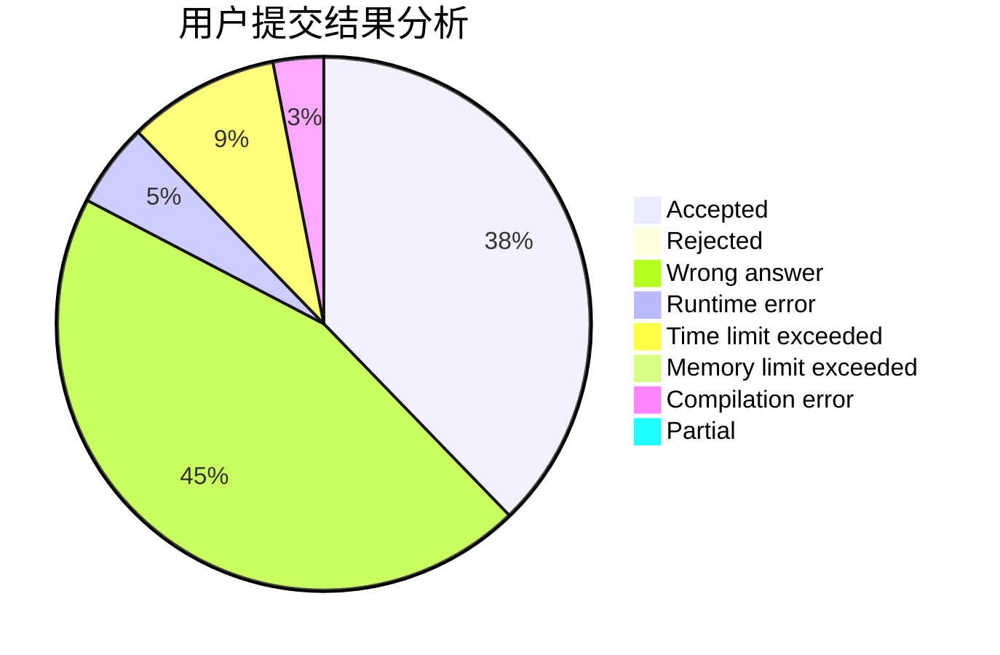
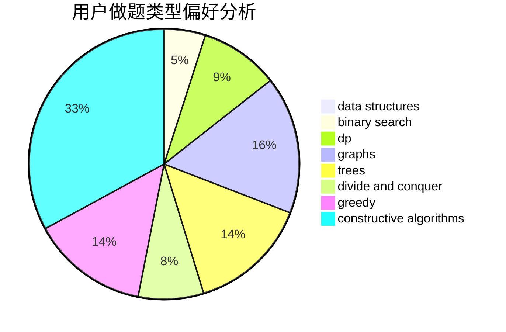

# bfx0215

<!-- tabs:start -->

#### **用户提交结果分析**

#### **用户做题类型偏好分析**

#### **用户错题知识点分析**

<!-- tabs:end -->
# 推荐题目
[1375F](https://codeforces.com/contest/1375/problem/F)		constructive algorithms,
                        games,
                        interactive,
                        math		  
[306D](https://codeforces.com/contest/306/problem/D)		constructive algorithms,
                        geometry		  
[799F](https://codeforces.com/contest/799/problem/F)		data structures		  
[472C](https://codeforces.com/contest/472/problem/C)		greedy		  
[197A](https://codeforces.com/contest/197/problem/A)		constructive algorithms,
                        games,
                        math		  
[443A](https://codeforces.com/contest/443/problem/A)		constructive algorithms,
                        implementation		  
[543E](https://codeforces.com/contest/543/problem/E)		constructive algorithms,
                        data structures		  
[739A](https://codeforces.com/contest/739/problem/A)		constructive algorithms,
                        greedy		  
[755F](https://codeforces.com/contest/755/problem/F)		bitmasks,
                        dp,
                        greedy		  
[335D](https://codeforces.com/contest/335/problem/D)		brute force,
                        dp		  
