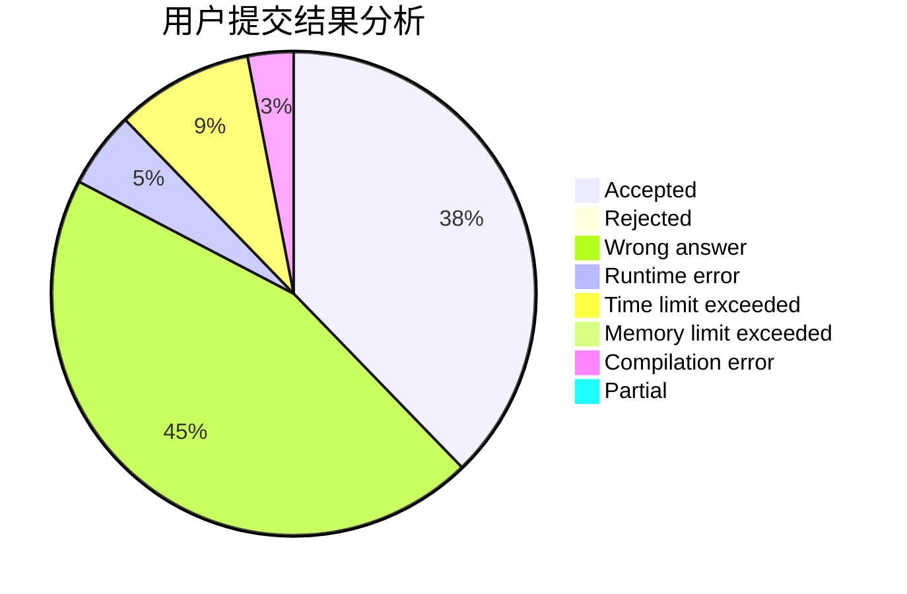
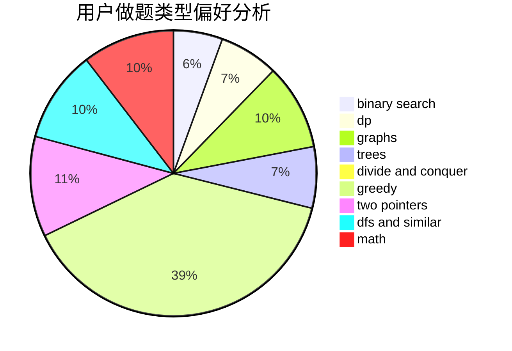

# bfx0215

<!-- tabs:start -->

#### **用户提交结果分析**

#### **用户做题类型偏好分析**

<!-- tabs:end -->
# 推荐题目
[1384E](https://codeforces.com/contest/1384/problem/E)
[329B](https://codeforces.com/contest/329/problem/B)
[813F](https://codeforces.com/contest/813/problem/F)
[490F](https://codeforces.com/contest/490/problem/F)
[219A](https://codeforces.com/contest/219/problem/A)
[463D](https://codeforces.com/contest/463/problem/D)
[568A](https://codeforces.com/contest/568/problem/A)
[759E](https://codeforces.com/contest/759/problem/E)
[774C](https://codeforces.com/contest/774/problem/C)
[362C](https://codeforces.com/contest/362/problem/C)
