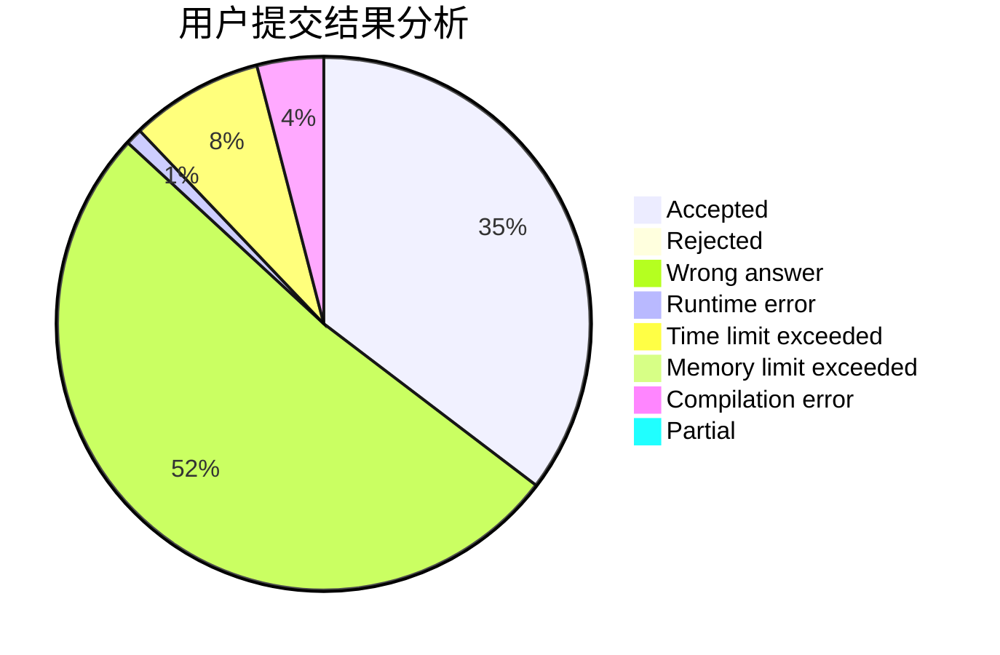
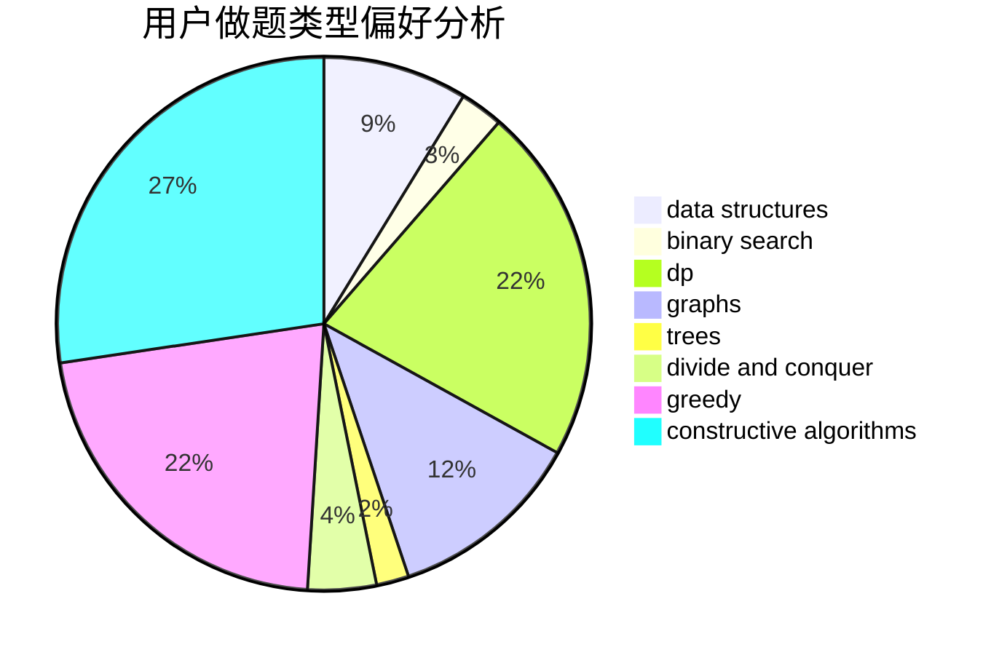

# biaohongAK

<!-- tabs:start -->

#### **用户提交结果分析**

#### **用户做题类型偏好分析**

#### **用户错题知识点分析**

<!-- tabs:end -->
# 推荐题目
[772E](https://codeforces.com/contest/772/problem/E)		binary search,
                        divide and conquer,
                        interactive,
                        trees		  
[33A](https://codeforces.com/contest/33/problem/A)		greedy,
                        implementation		  
[1058C](https://codeforces.com/contest/1058/problem/C)		dsu,graphs,sortings,trees		  
[923B](https://codeforces.com/contest/923/problem/B)		binary search,
                        data structures		  
[1165C](https://codeforces.com/contest/1165/problem/C)		greedy		  
[1054F](https://codeforces.com/contest/1054/problem/F)		flows,
                        graph matchings		  
[542E](https://codeforces.com/contest/542/problem/E)		graphs,
                        shortest paths		  
[820D](https://codeforces.com/contest/820/problem/D)		dsu,graphs,sortings,trees		  
[1080B](https://codeforces.com/contest/1080/problem/B)		math		  
[682A](https://codeforces.com/contest/682/problem/A)		constructive algorithms,
                        math,
                        number theory		  
