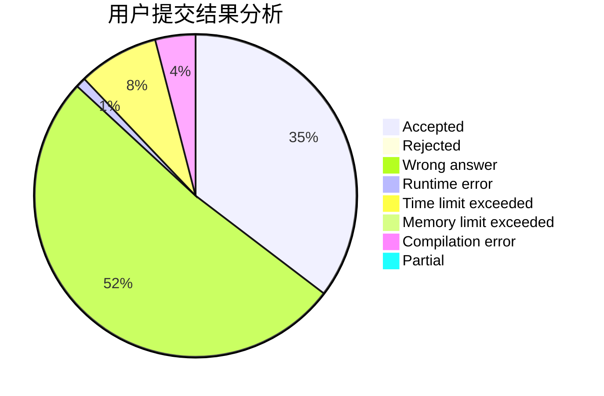
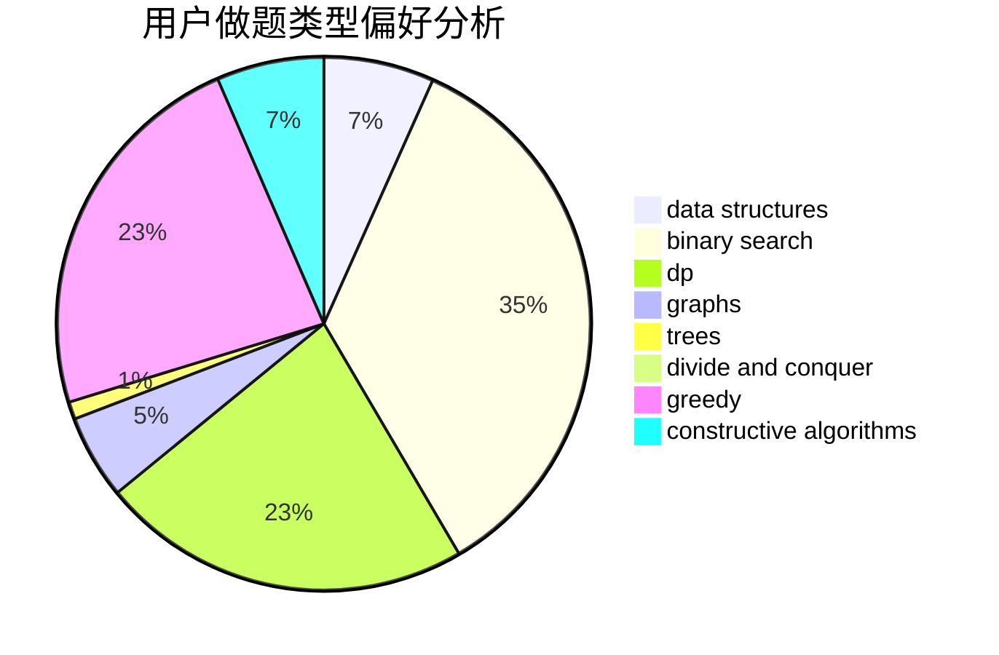

# biaohongAK

<!-- tabs:start -->

#### **用户提交结果分析**

#### **用户做题类型偏好分析**

#### **用户错题知识点分析**

<!-- tabs:end -->
# 推荐题目
[792C](https://codeforces.com/contest/792/problem/C)		dp,
                        greedy,
                        math,
                        number theory		  
[367B](https://codeforces.com/contest/367/problem/B)		binary search,
                        data structures		  
[1059A](https://codeforces.com/contest/1059/problem/A)		implementation		  
[946G](https://codeforces.com/contest/946/problem/G)		data structures,
                        dp		  
[1167E](https://codeforces.com/contest/1167/problem/E)		binary search,
                        combinatorics,
                        data structures,
                        two pointers		  
[1055A](https://codeforces.com/contest/1055/problem/A)		graphs		  
[567A](https://codeforces.com/contest/567/problem/A)		greedy,
                        implementation		  
[840D](https://codeforces.com/contest/840/problem/D)		data structures,
                        probabilities		  
[1080E](https://codeforces.com/contest/1080/problem/E)		strings		  
[706A](https://codeforces.com/contest/706/problem/A)		brute force,
                        geometry,
                        implementation		  
