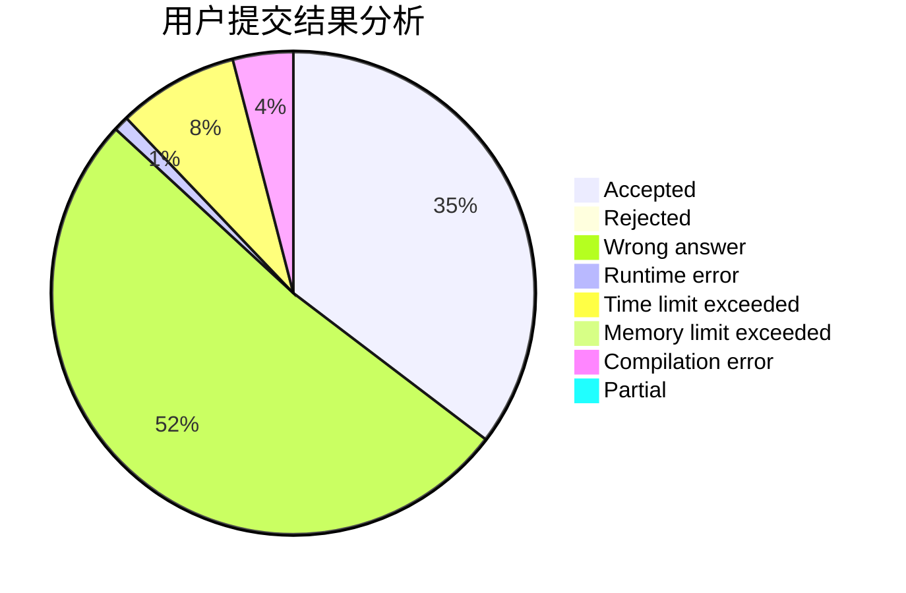
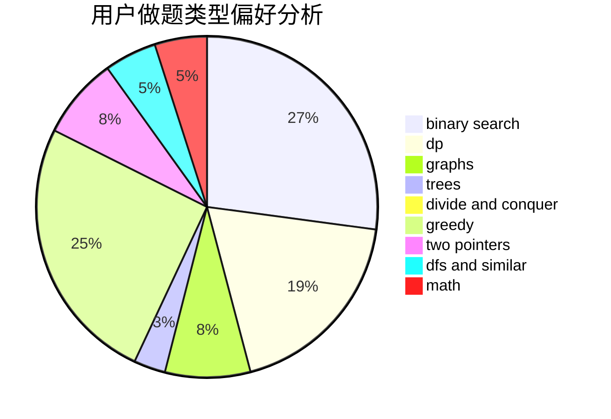

# biaohongAK

<!-- tabs:start -->

#### **用户提交结果分析**

#### **用户做题类型偏好分析**

<!-- tabs:end -->
# 推荐题目
[792C](https://codeforces.com/contest/792/problem/C)
[367B](https://codeforces.com/contest/367/problem/B)
[1059A](https://codeforces.com/contest/1059/problem/A)
[946G](https://codeforces.com/contest/946/problem/G)
[1167E](https://codeforces.com/contest/1167/problem/E)
[1055A](https://codeforces.com/contest/1055/problem/A)
[567A](https://codeforces.com/contest/567/problem/A)
[840D](https://codeforces.com/contest/840/problem/D)
[1080E](https://codeforces.com/contest/1080/problem/E)
[706A](https://codeforces.com/contest/706/problem/A)
