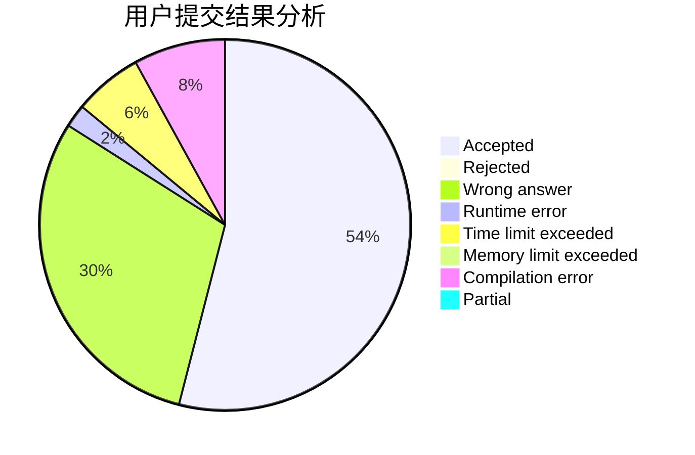
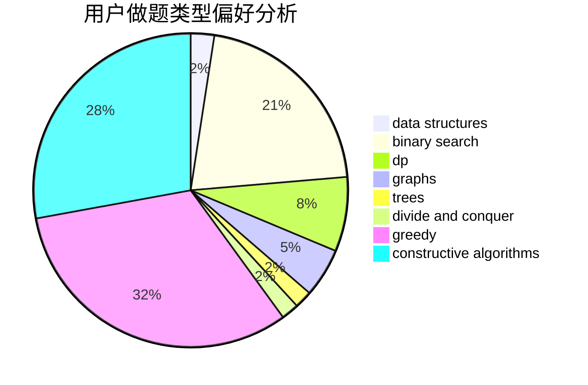
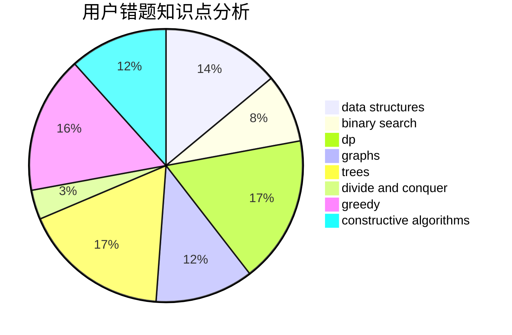

# bilibash

<!-- tabs:start -->

#### **用户提交结果分析**

#### **用户做题类型偏好分析**

#### **用户错题知识点分析**

<!-- tabs:end -->
# 推荐题目
[1380G](https://codeforces.com/contest/1380/problem/G)		greedy,
                        math,
                        probabilities		  
[908D](https://codeforces.com/contest/908/problem/D)		dp,
                        math,
                        probabilities		  
[1028H](https://codeforces.com/contest/1028/problem/H)		math		  
[812E](https://codeforces.com/contest/812/problem/E)		games,
                        trees		  
[1291E](https://codeforces.com/contest/1291/problem/E)		dsu,graphs,sortings,trees		  
[165A](https://codeforces.com/contest/165/problem/A)		implementation		  
[938D](https://codeforces.com/contest/938/problem/D)		data structures,
                        graphs,
                        shortest paths		  
[1238E](https://codeforces.com/contest/1238/problem/E)		bitmasks,
                        dp		  
[535C](https://codeforces.com/contest/535/problem/C)		binary search,
                        greedy,
                        math		  
[1290C](https://codeforces.com/contest/1290/problem/C)		dfs and similar,
                        dsu,
                        graphs		  
