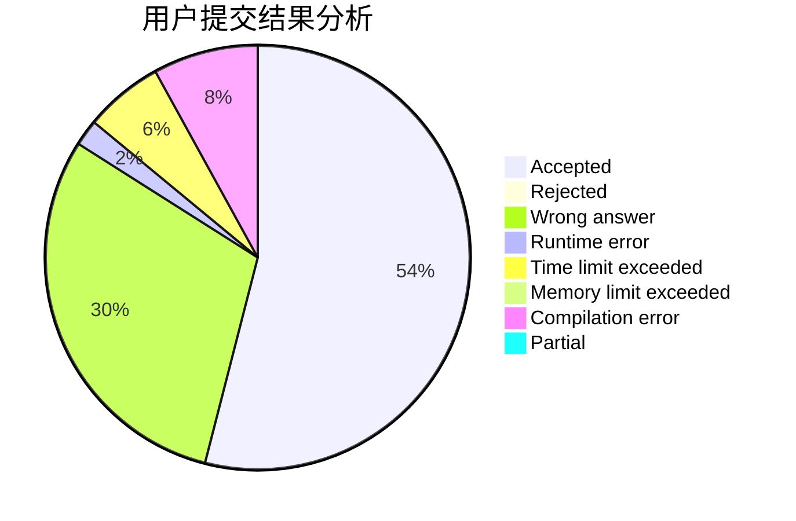
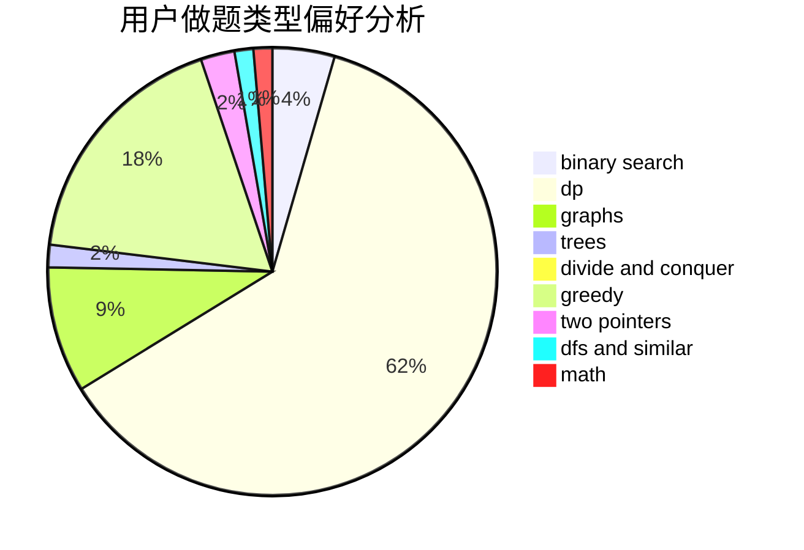

# bilibash

<!-- tabs:start -->

#### **用户提交结果分析**

#### **用户做题类型偏好分析**

<!-- tabs:end -->
# 推荐题目
[1391A](https://codeforces.com/contest/1391/problem/A)
[922E](https://codeforces.com/contest/922/problem/E)
[1029C](https://codeforces.com/contest/1029/problem/C)
[831B](https://codeforces.com/contest/831/problem/B)
[1298D](https://codeforces.com/contest/1298/problem/D)
[18C](https://codeforces.com/contest/18/problem/C)
[95E](https://codeforces.com/contest/95/problem/E)
[1243E](https://codeforces.com/contest/1243/problem/E)
[558A](https://codeforces.com/contest/558/problem/A)
[1296F](https://codeforces.com/contest/1296/problem/F)
