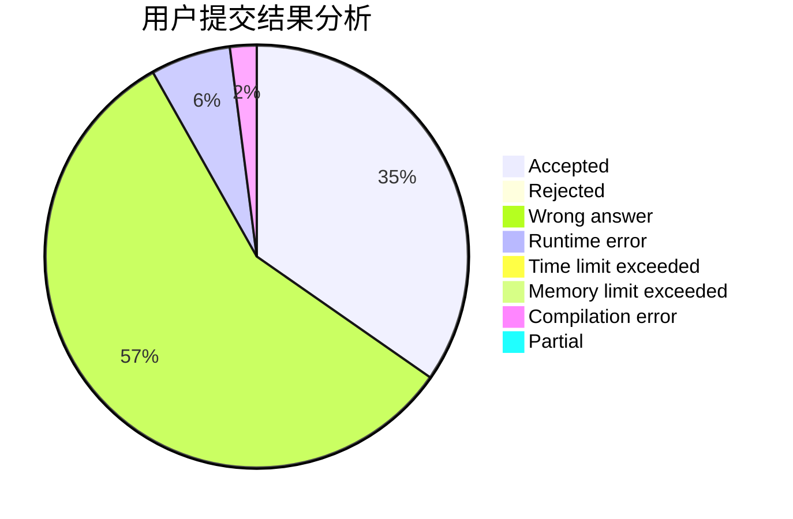
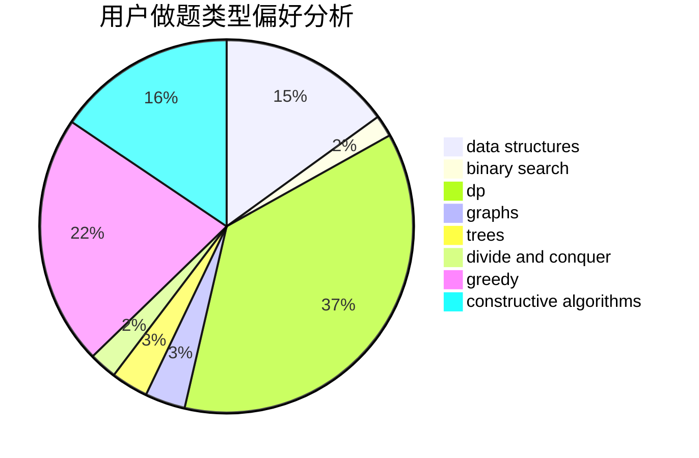
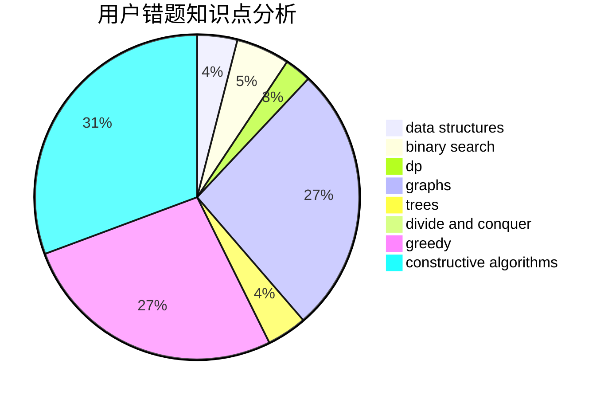

# bilibi1i

<!-- tabs:start -->

#### **用户提交结果分析**

#### **用户做题类型偏好分析**

#### **用户错题知识点分析**

<!-- tabs:end -->
# 推荐题目
[912E](https://codeforces.com/contest/912/problem/E)		binary search,
                        dfs and similar,
                        math,
                        meet-in-the-middle,
                        number theory,
                        two pointers		  
[870A](https://codeforces.com/contest/870/problem/A)		brute force,
                        implementation		  
[443D](https://codeforces.com/contest/443/problem/D)		dsu,graphs,sortings,trees		  
[632C](https://codeforces.com/contest/632/problem/C)		sortings,
                        strings		  
[1240A](https://codeforces.com/contest/1240/problem/A)		dsu,graphs,sortings,trees		  
[815A](https://codeforces.com/contest/815/problem/A)		brute force,
                        greedy,
                        implementation		  
[1000C](https://codeforces.com/contest/1000/problem/C)		data structures,
                        implementation,
                        sortings		  
[13781](https://codeforces.com/contest/1378/problem/1)		dsu,graphs,sortings,trees		  
[1042F](https://codeforces.com/contest/1042/problem/F)		data structures,
                        dfs and similar,
                        dsu,
                        graphs,
                        greedy,
                        sortings,
                        trees		  
[1209C](https://codeforces.com/contest/1209/problem/C)		constructive algorithms,
                        greedy,
                        implementation		  
