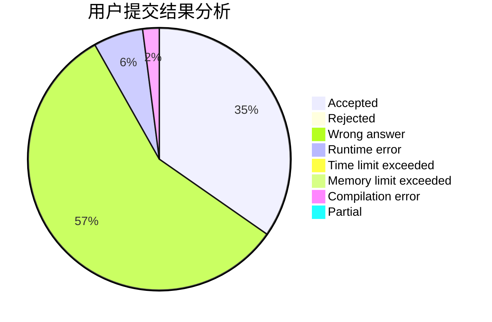
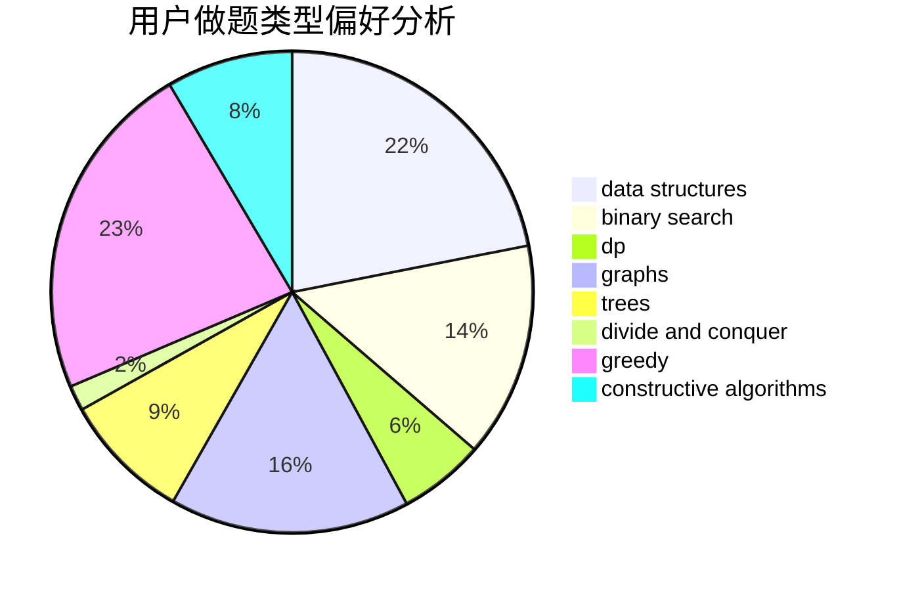
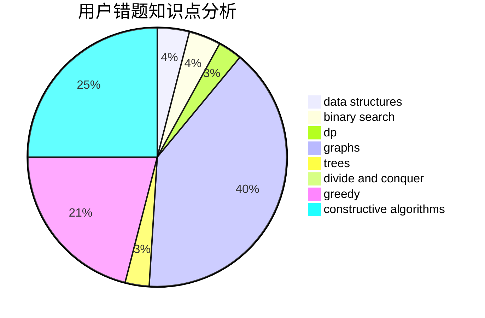

# bilibi1i

<!-- tabs:start -->

#### **用户提交结果分析**

#### **用户做题类型偏好分析**

#### **用户错题知识点分析**

<!-- tabs:end -->
# 推荐题目
[895B](https://codeforces.com/contest/895/problem/B)		binary search,
                        math,
                        sortings,
                        two pointers		  
[851D](https://codeforces.com/contest/851/problem/D)		dsu,graphs,sortings,trees		  
[418C](https://codeforces.com/contest/418/problem/C)		dsu,graphs,sortings,trees		  
[612F](https://codeforces.com/contest/612/problem/F)		dp		  
[1234D](https://codeforces.com/contest/1234/problem/D)		data structures		  
[7E](https://codeforces.com/contest/7/problem/E)		dp,
                        expression parsing,
                        implementation		  
[1000C](https://codeforces.com/contest/1000/problem/C)		data structures,
                        implementation,
                        sortings		  
[136C](https://codeforces.com/contest/136/problem/C)		dsu,graphs,sortings,trees		  
[1042C](https://codeforces.com/contest/1042/problem/C)		constructive algorithms,
                        greedy,
                        math		  
[1205A](https://codeforces.com/contest/1205/problem/A)		constructive algorithms,
                        greedy,
                        math		  
