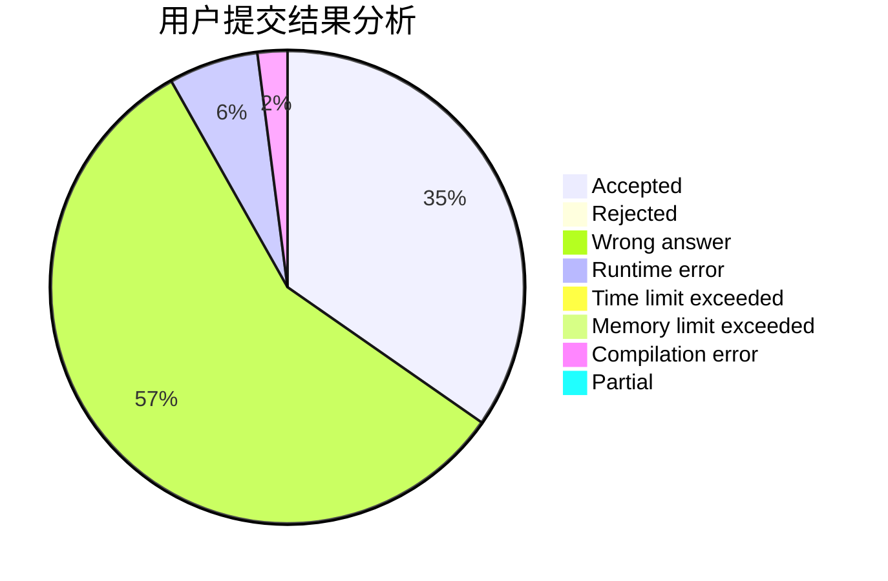
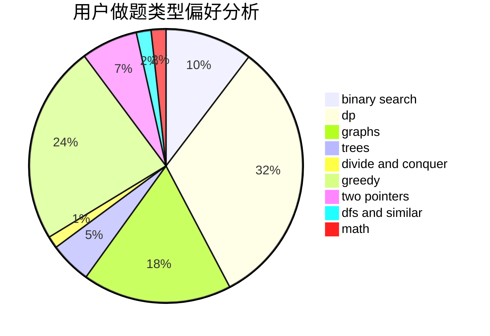

# bilibi1i

<!-- tabs:start -->

#### **用户提交结果分析**

#### **用户做题类型偏好分析**

<!-- tabs:end -->
# 推荐题目
[912E](https://codeforces.com/contest/912/problem/E)
[870A](https://codeforces.com/contest/870/problem/A)
[443D](https://codeforces.com/contest/443/problem/D)
[632C](https://codeforces.com/contest/632/problem/C)
[1240A](https://codeforces.com/contest/1240/problem/A)
[815A](https://codeforces.com/contest/815/problem/A)
[1000C](https://codeforces.com/contest/1000/problem/C)
[13781](https://codeforces.com/contest/1378/problem/1)
[1042F](https://codeforces.com/contest/1042/problem/F)
[1209C](https://codeforces.com/contest/1209/problem/C)
