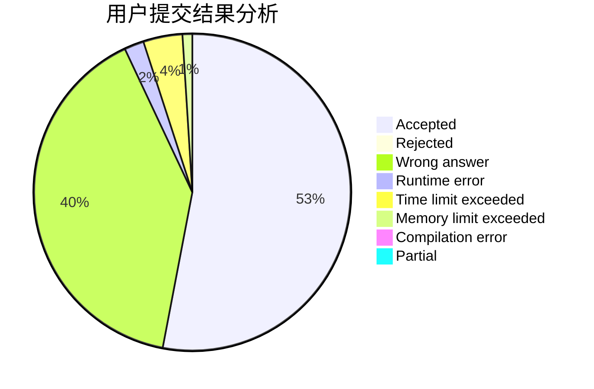
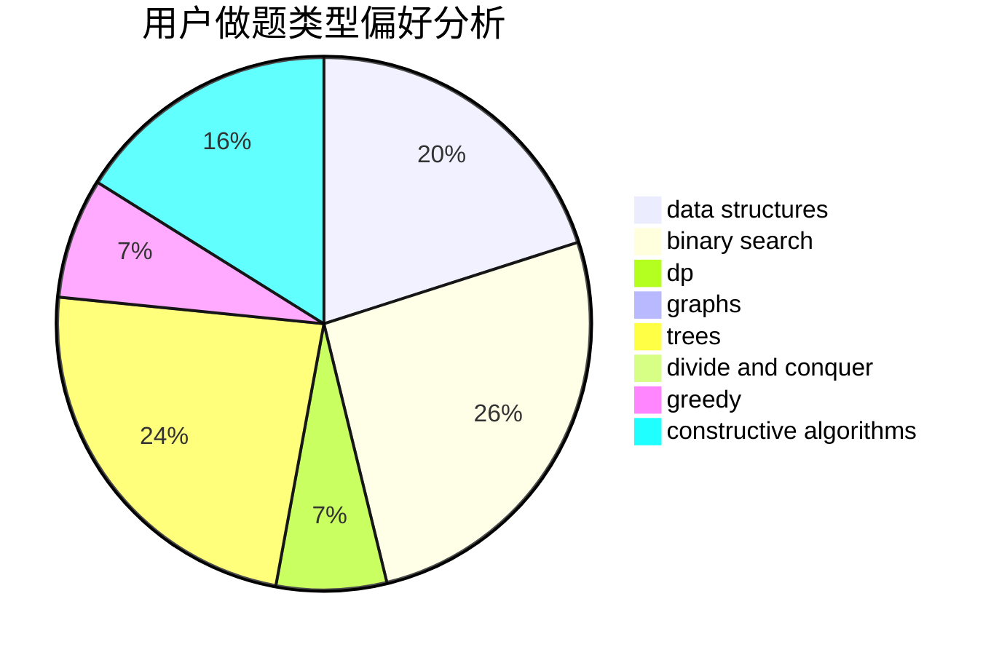
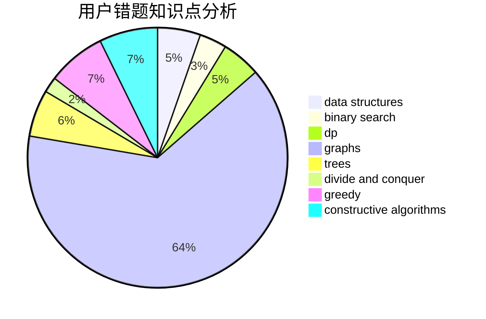

# binarycopycode

<!-- tabs:start -->

#### **用户提交结果分析**

#### **用户做题类型偏好分析**

#### **用户错题知识点分析**

<!-- tabs:end -->
# 推荐题目
[1364D](https://codeforces.com/contest/1364/problem/D)		constructive algorithms,
                        dfs and similar,
                        graphs,
                        greedy,
                        implementation,
                        trees		  
[1296A](https://codeforces.com/contest/1296/problem/A)		math		  
[900E](https://codeforces.com/contest/900/problem/E)		data structures,
                        dp,
                        strings		  
[494E](https://codeforces.com/contest/494/problem/E)		data structures,
                        games		  
[1405C](https://codeforces.com/contest/1405/problem/C)		dsu,graphs,sortings,trees		  
[1282B1](https://codeforces.com/contest/1282B/problem/1)		dp,
                        greedy,
                        sortings		  
[884A](https://codeforces.com/contest/884/problem/A)		implementation		  
[687C](https://codeforces.com/contest/687/problem/C)		dp		  
[865A](https://codeforces.com/contest/865/problem/A)		constructive algorithms		  
[578C](https://codeforces.com/contest/578/problem/C)		ternary search		  
