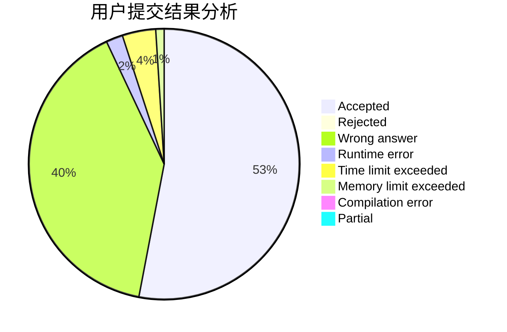
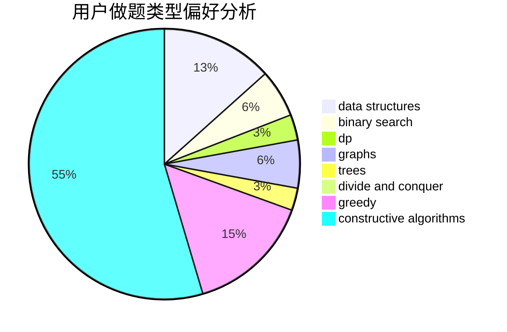
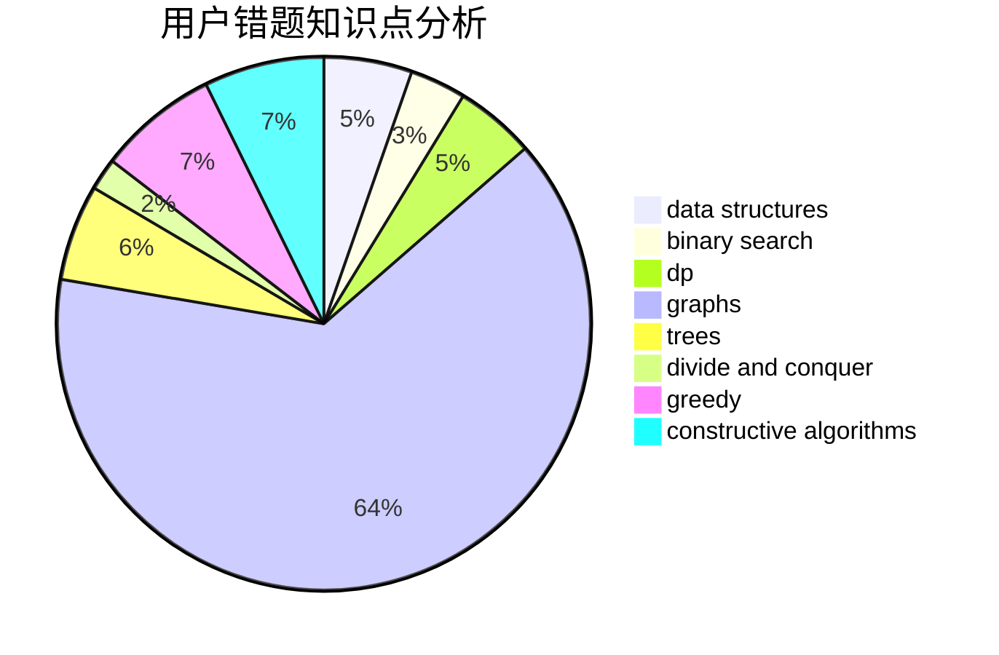

# binarycopycode

<!-- tabs:start -->

#### **用户提交结果分析**

#### **用户做题类型偏好分析**

#### **用户错题知识点分析**

<!-- tabs:end -->
# 推荐题目
[1371B](https://codeforces.com/contest/1371/problem/B)		math		  
[1303C](https://codeforces.com/contest/1303/problem/C)		dfs and similar,
                        greedy,
                        implementation		  
[917C](https://codeforces.com/contest/917/problem/C)		combinatorics,
                        dp,
                        matrices		  
[515A](https://codeforces.com/contest/515/problem/A)		math		  
[1416D](https://codeforces.com/contest/1416/problem/D)		data structures,
                        dsu,
                        graphs,
                        implementation,
                        trees		  
[1288D](https://codeforces.com/contest/1288/problem/D)		binary search,
                        bitmasks,
                        dp		  
[902B](https://codeforces.com/contest/902/problem/B)		dfs and similar,
                        dsu,
                        greedy		  
[709B](https://codeforces.com/contest/709/problem/B)		greedy,
                        implementation,
                        sortings		  
[884D](https://codeforces.com/contest/884/problem/D)		data structures,
                        greedy		  
[599E](https://codeforces.com/contest/599/problem/E)		bitmasks,
                        dp,
                        trees		  
