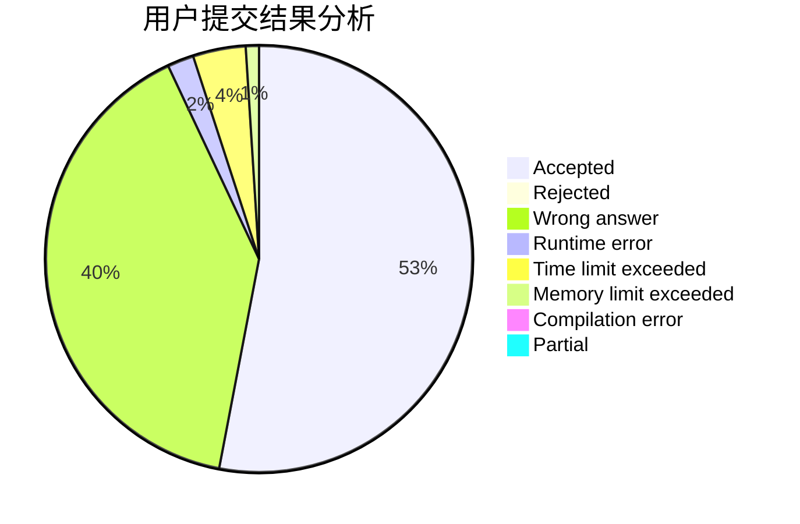
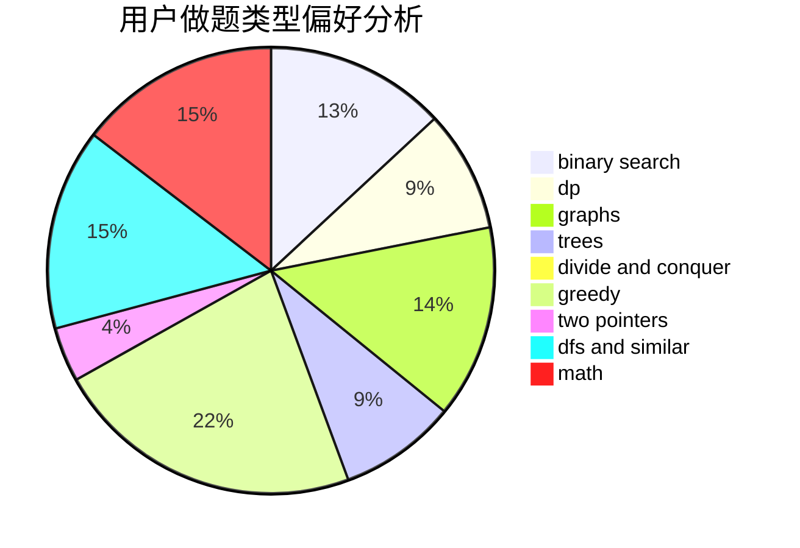

# binarycopycode

<!-- tabs:start -->

#### **用户提交结果分析**

#### **用户做题类型偏好分析**

<!-- tabs:end -->
# 推荐题目
[1371B](https://codeforces.com/contest/1371/problem/B)
[1303C](https://codeforces.com/contest/1303/problem/C)
[917C](https://codeforces.com/contest/917/problem/C)
[515A](https://codeforces.com/contest/515/problem/A)
[1416D](https://codeforces.com/contest/1416/problem/D)
[1288D](https://codeforces.com/contest/1288/problem/D)
[902B](https://codeforces.com/contest/902/problem/B)
[709B](https://codeforces.com/contest/709/problem/B)
[884D](https://codeforces.com/contest/884/problem/D)
[599E](https://codeforces.com/contest/599/problem/E)
