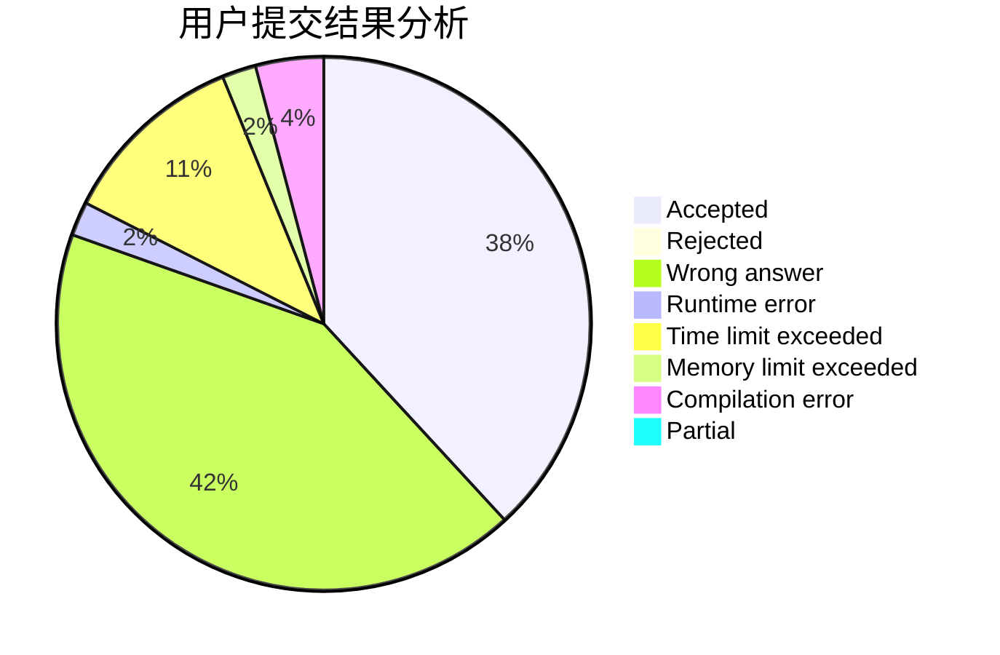
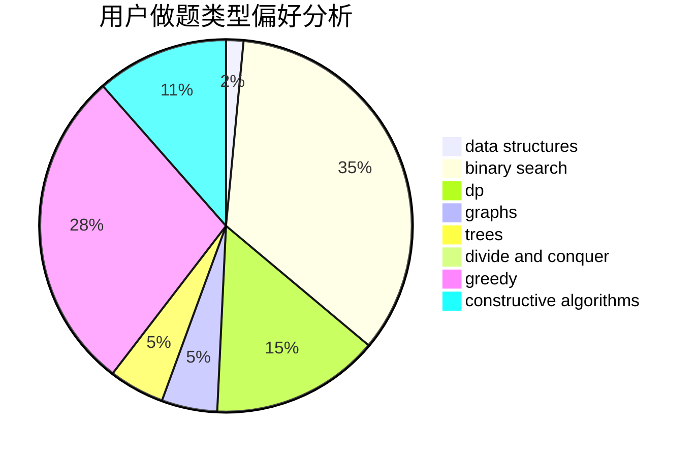

# birchtree

<!-- tabs:start -->

#### **用户提交结果分析**

#### **用户做题类型偏好分析**

#### **用户错题知识点分析**

<!-- tabs:end -->
# 推荐题目
[1114A](https://codeforces.com/contest/1114/problem/A)		brute force,
                        greedy,
                        implementation		  
[1220A](https://codeforces.com/contest/1220/problem/A)		implementation,
                        sortings,
                        strings		  
[1082F](https://codeforces.com/contest/1082/problem/F)		dp,
                        strings,
                        trees		  
[735C](https://codeforces.com/contest/735/problem/C)		combinatorics,
                        constructive algorithms,
                        greedy,
                        math		  
[554A](https://codeforces.com/contest/554/problem/A)		brute force,
                        math,
                        strings		  
[1083F](https://codeforces.com/contest/1083/problem/F)		data structures		  
[1046H](https://codeforces.com/contest/1046/problem/H)		dsu,graphs,sortings,trees		  
[883A](https://codeforces.com/contest/883/problem/A)		implementation		  
[883I](https://codeforces.com/contest/883/problem/I)		binary search,
                        dp		  
[405B](https://codeforces.com/contest/405/problem/B)		nan		  
